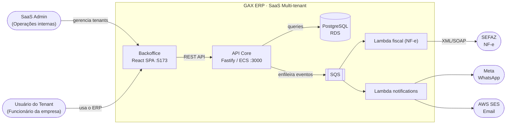
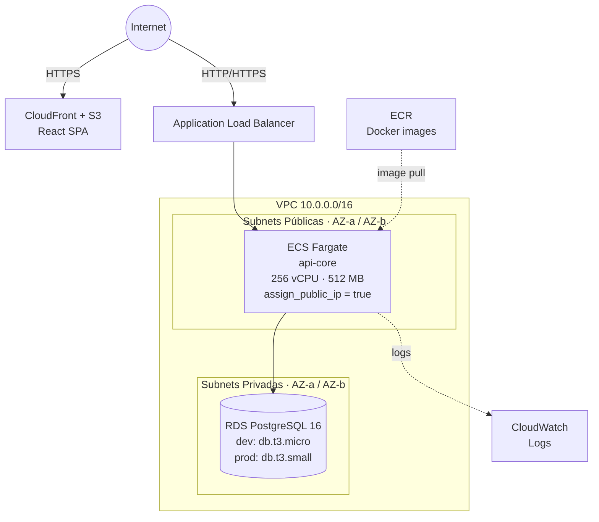

# GAX ERP — SaaS Multi-tenant ERP on AWS

> **Este README é o prompt principal para geração de código por IA.**
> Antes de implementar qualquer funcionalidade, leia este arquivo na íntegra.
> Ele define a fonte da verdade sobre schema, rotas, componentes e convenções.

---

## Protocolo Anti-alucinação (leia primeiro)

Regras que toda IA assistindo este projeto DEVE seguir antes de gerar código:

1. **Nunca inventar tabelas ou colunas.** O schema de banco de dados está documentado neste README e nos arquivos `services/api-core/db/migrations/000N_*.sql`. Antes de usar qualquer tabela/coluna, confirme que ela existe.

2. **Nunca inventar rotas de API.** Todas as rotas existentes estão listadas na seção "API Reference". Se uma rota não está aqui, ela não existe.

3. **Nunca inventar componentes, hooks ou classes CSS.** Os componentes React existentes estão em `apps/backoffice/src/components/` e `apps/backoffice/src/pages/`. As classes CSS existem em `apps/backoffice/src/index.css` — leia o arquivo antes de usar qualquer classe.

4. **Nunca usar `tenant_id` do body da requisição em código de produção.** O `tenant_id` vem sempre do JWT (`request.user.tenantId`). A exceção atual (tenant_id no body) é temporária enquanto o auth Lambda não está integrado.

5. **Nunca assumir que uma biblioteca está instalada** sem verificar `package.json`. O projeto usa exatamente o que está declarado em `services/api-core/package.json` e `apps/backoffice/package.json`.

6. **Sempre ler o arquivo antes de editá-lo.** Usar o conteúdo real como base — não o que você imagina que está lá.

7. **Sempre adicionar chaves de i18n nos dois arquivos:** `apps/backoffice/src/i18n/pt-BR.ts` (source of truth para `TKey`) e `apps/backoffice/src/i18n/en.ts` (deve ter todas as mesmas chaves, ou o TypeScript dará erro de compilação).

8. **Nunca deletar fisicamente registros.** Todos os soft-deletes estão documentados por módulo abaixo.

9. **Nunca concatenar strings em SQL.** Usar sempre `$1, $2, ...` parametrizado.

10. **Ao adicionar um novo módulo**, seguir o checklist completo da seção "Adicionando um novo módulo".

---

## Histórico de Prompts

### v0.1 — Kickoff
> Novo projeto ERP SaaS, multitenant, AWS. Monorepo Fastify + Node + React.
> Lambda para serviços pontuais. Cadastro de clientes com campos: Empresa, CNPJ,
> Endereço, Telefone, Contatos (compras/manutenção/fiscal) com tel e email.
> Campos em inglês para venda global. Banco PostgreSQL.

### v0.2 — Materiais + Docker + AWS
> Adicionar cadastro de materiais para venda de produtos e serviços com estoque.
> Iniciar abordagem para rodar localmente no Docker e estrutura para rodar na AWS
> com menor custo possível. Atualizar README como prompt para IA.

### v0.3 — Backoffice + Auth
> Adicionar tela de login e cadastro básico para rodar localmente. Auth integrada
> no api-core (login/register com bcrypt + JWT). React SPA em apps/backoffice
> com React Router, contexto de auth e páginas: Login, Register, Dashboard, Materials.

### v0.4 — Identidade visual GAX + Módulo Clientes (PJ/PF)
> Empresa se chama GAX. Criar logo moderno para a tela de login. Implementar
> migrations básico para rodar localmente. No cadastro de clientes prever que
> uma empresa pode emitir NF-e para CNPJ e CPF — adicionar campos necessários.

### v0.5 — Globalização pt-BR + CNPJ fix + CI/CD + Users CRUD
> Globalizar todas as labels para português-BR com toggle EN. Corrigir validação
> de CNPJ (peso inicial era n-7, correto é n-8). GitHub Actions CI/CD pipeline.
> CRUD de usuários por tenant com roles. Fix: login case-insensitive + seed script.

### v0.6 — Pedidos de Venda + Notas Fiscais
> Telas de gestão de pedidos (Pedidos de Venda com baixa automática de estoque,
> status: draft→confirmed→invoiced→delivered|cancelled) e Notas Fiscais
> (draft→issued|cancelled, geração sequencial de número por série, vínculo com pedido).
> README reescrito como prompt anti-alucinação com protocolo de uso para IA.

---

## Visão Geral

**GAX Enterprise** é um ERP SaaS multi-tenant construído em Node.js/Fastify,
com frontend React (identidade visual GAX), banco PostgreSQL, deployado na AWS
com custo mínimo.

**Modelo multi-tenant:** shared database, shared schema — todas as tabelas ERP
carregam `tenant_id`. O `tenant_id` é sempre extraído do JWT (nunca do body da
requisição), garantindo isolamento por camada de aplicação.

---

## Diagramas de Arquitetura

### Contexto (C4 Nível 1)



### Infraestrutura AWS



> **Sem NAT Gateway:** ECS tasks ficam em subnet pública com `assign_public_ip = true`.
> Economia: ~$30/mês.

---

## Stack Tecnológica

| Camada | Tecnologia | Versão | Justificativa |
|--------|-----------|--------|---------------|
| API | Node.js + Fastify + TypeScript | 20 / 4.x / 5.x | Alto throughput, schemas JSON nativos |
| Banco | PostgreSQL | 16 (RDS) | ACID, UUID nativo, triggers |
| Frontend | React + Vite + TypeScript | 18 / 5.x / 5.x | SPA com proxy de API |
| Auth | bcryptjs (salt 12) + @fastify/jwt (HS256 24h) | — | Stateless |
| i18n | Context API customizado | — | pt-BR padrão, EN toggle |
| Infra | Terraform + ECS Fargate | ≥ 1.5 | IaC reproduzível |
| CI/CD | GitHub Actions | — | Build + ECR push + ECS deploy |

---

## Estrutura do Projeto (fonte da verdade)

```
erp-lite/
├── docker-compose.yml              ← ambiente local completo
├── package.json                    ← monorepo npm workspaces
│
├── services/api-core/              ← ECS Fargate — API Fastify
│   ├── Dockerfile                  ← multi-stage: development | builder | production
│   ├── package.json                ← deps: fastify, @fastify/jwt, @fastify/sensible,
│   │                                        @fastify/cors, bcryptjs, pg
│   ├── src/
│   │   ├── index.ts                ← entry point (porta 3000)
│   │   ├── app.ts                  ← Fastify factory + registro de rotas
│   │   ├── config.ts               ← variáveis de ambiente
│   │   ├── db/pool.ts              ← pg.Pool singleton
│   │   ├── routes/
│   │   │   ├── auth.ts             ← POST /v1/auth/login|register, GET /v1/auth/me
│   │   │   ├── customers.ts        ← CRUD /v1/customers (tenants SaaS)
│   │   │   ├── materials.ts        ← CRUD /v1/materials + /v1/stock/*
│   │   │   ├── clients.ts          ← CRUD /v1/clients (PJ/PF — NF-e ready)
│   │   │   ├── users.ts            ← CRUD /v1/users (por tenant)
│   │   │   ├── orders.ts           ← CRUD /v1/orders + confirm/deliver/cancel
│   │   │   └── invoices.ts         ← CRUD /v1/invoices + issue/cancel
│   │   └── scripts/
│   │       ├── migrate.ts          ← runner de migrations SQL (executa em ordem)
│   │       └── seed.ts             ← cria usuário admin para dev local
│   └── db/migrations/
│       ├── 0001_tenants.sql
│       ├── 0002_users.sql
│       ├── 0003_materials.sql
│       ├── 0004_inventory.sql
│       ├── 0005_clients.sql
│       ├── 0006_orders.sql         ← orders + order_items
│       └── 0007_invoices.sql       ← invoices + invoice_items
│
├── apps/backoffice/                ← React + Vite SPA
│   ├── vite.config.ts              ← proxy /v1/* e /health → api-core:3000
│   ├── src/
│   │   ├── main.tsx                ← bootstrap React
│   │   ├── App.tsx                 ← BrowserRouter + rotas guardadas
│   │   ├── index.css               ← design system completo (classes abaixo)
│   │   ├── contexts/
│   │   │   └── AuthContext.tsx     ← login/register/logout + estado global
│   │   ├── components/
│   │   │   ├── Layout.tsx          ← sidebar com navegação
│   │   │   └── GaxLogo.tsx         ← logo GAX
│   │   ├── i18n/
│   │   │   ├── index.tsx           ← I18nProvider + useI18n() hook
│   │   │   ├── pt-BR.ts            ← SOURCE OF TRUTH para TKey (tipo derivado aqui)
│   │   │   └── en.ts               ← Record<TKey, string> — deve ter TODOS os keys
│   │   ├── lib/
│   │   │   ├── api.ts              ← fetch wrapper (ApiError com status HTTP)
│   │   │   └── brazil.ts           ← maskCNPJ, isValidCNPJ, digits (CPF/CNPJ)
│   │   └── pages/
│   │       ├── LoginPage.tsx
│   │       ├── RegisterPage.tsx
│   │       ├── DashboardPage.tsx
│   │       ├── clients/ClientsPage.tsx
│   │       ├── materials/MaterialsPage.tsx
│   │       ├── users/UsersPage.tsx
│   │       ├── orders/OrdersPage.tsx
│   │       └── invoices/InvoicesPage.tsx
│
└── terraform/
    ├── variables.tf  main.tf  security.tf  rds.tf  ecs.tf  ecr.tf  outputs.tf
```

---

## Schema do Banco de Dados (fonte da verdade)

### Convenções
- UUID PKs com `gen_random_uuid()`
- `created_at / updated_at TIMESTAMPTZ NOT NULL DEFAULT NOW()` em todas as tabelas
- `updated_at` atualizado via trigger `update_updated_at()` definido em `0001_tenants.sql`
- `tenant_id UUID NOT NULL REFERENCES tenants(id)` em toda tabela ERP
- Soft-delete: `is_active = false` (materials, clients) ou `status = 'disabled'` (users) ou `status = 'cancelled'` (orders, invoices)
- Nunca deletar fisicamente registros ERP

### `tenants`
| Campo | Tipo | Notas |
|-------|------|-------|
| id | UUID PK | |
| company_name | VARCHAR(255) NOT NULL | Razão social |
| trade_name | VARCHAR(255) | Nome fantasia |
| tax_id | VARCHAR(50) NOT NULL | CNPJ / EIN / VAT |
| tax_id_type | VARCHAR(10) NOT NULL | `CNPJ`\|`EIN`\|`VAT`\|`OTHER` |
| street..country | VARCHAR | Endereço completo |
| purchasing/maintenance/fiscal _contact_* | VARCHAR | 3 contatos × nome/tel/email |
| status | VARCHAR(20) | `trial`\|`active`\|`suspended`\|`cancelled` |
| plan | VARCHAR(30) | `starter`\|`professional`\|`enterprise` |
| trial_ends_at | TIMESTAMPTZ | |
| **UNIQUE** | (tax_id, tax_id_type) | |

### `users`
| Campo | Tipo | Notas |
|-------|------|-------|
| id | UUID PK | |
| tenant_id | UUID FK → tenants | |
| email | VARCHAR(255) | Único por tenant. Armazenado em lowercase |
| name | VARCHAR(255) NOT NULL | |
| password_hash | TEXT NOT NULL | bcrypt salt=12 |
| role | VARCHAR(20) | `owner`\|`admin`\|`manager`\|`user` |
| status | VARCHAR(20) | `active`\|`disabled` |
| **UNIQUE** | (tenant_id, email) | |

### `materials`
| Campo | Tipo | Notas |
|-------|------|-------|
| id | UUID PK | |
| tenant_id | UUID FK | |
| sku | VARCHAR(100) NOT NULL | **UNIQUE** (tenant_id, sku) |
| name | VARCHAR(255) NOT NULL | |
| description | TEXT | |
| type | VARCHAR(20) | `product`\|`service`\|`raw_material`\|`asset` |
| category / brand / unit | VARCHAR | unit padrão `UN` |
| sale_price / cost_price | DECIMAL(15,2) | |
| ncm_code | VARCHAR(10) | NCM brasileiro |
| tax_group | VARCHAR(50) | Uso futuro (módulo fiscal) |
| weight_kg | DECIMAL(10,3) | |
| is_active | BOOLEAN DEFAULT true | Soft-delete |
| tracks_inventory | BOOLEAN DEFAULT true | false para serviços |

### `inventory`
| Campo | Tipo | Notas |
|-------|------|-------|
| id | UUID PK | |
| tenant_id | UUID FK | |
| material_id | UUID FK → materials | **UNIQUE** (tenant_id, material_id) |
| quantity | DECIMAL(15,3) DEFAULT 0 | Estoque atual |
| min_qty / max_qty | DECIMAL(15,3) | Alertas e reposição |

### `inventory_movements` (imutável — nunca deletar)
| Campo | Tipo | Notas |
|-------|------|-------|
| id | UUID PK | |
| tenant_id | UUID FK | |
| material_id | UUID FK → materials | |
| movement_type | VARCHAR(20) | `in`\|`out`\|`adjustment`\|`return`\|`transfer` |
| quantity | DECIMAL(15,3) | Delta (positivo) |
| quantity_before / quantity_after | DECIMAL(15,3) | Snapshot |
| reason | TEXT | Texto livre |
| reference_id | UUID | ID do pedido, NF etc. |
| reference_type | VARCHAR(50) | `order`\|`invoice`\|`adjustment` |
| created_by | UUID FK → users | |
| created_at | TIMESTAMPTZ | |

### `clients`
| Campo | Tipo | Notas |
|-------|------|-------|
| id | UUID PK | |
| tenant_id | UUID FK | |
| person_type | VARCHAR(2) | `PJ`\|`PF` |
| **PJ** | company_name NOT NULL, trade_name, cnpj (14 dígitos), state_reg, municipal_reg, suframa | |
| **PF** | full_name NOT NULL, cpf (11 dígitos), birth_date, rg, rg_issuer | |
| email / phone / mobile | VARCHAR | |
| zip_code..country | VARCHAR | Endereço |
| icms_taxpayer | CHAR(1) | `1`=Contribuinte `2`=Isento `9`=Não Contribuinte |
| consumer_type | CHAR(1) | `0`=B2B `1`=B2C (PF sempre `1`) |
| is_active | BOOLEAN | Soft-delete |
| **UNIQUE** | (tenant_id, cnpj), (tenant_id, cpf) | |

### `orders` *(migration: 0006_orders.sql)*
| Campo | Tipo | Notas |
|-------|------|-------|
| id | UUID PK | |
| tenant_id | UUID FK → tenants | |
| client_id | UUID FK → clients | |
| number | VARCHAR(20) NOT NULL | Sequencial por tenant, formato `00001` |
| status | VARCHAR(20) | `draft`→`confirmed`→`invoiced`→`delivered`\|`cancelled` |
| notes | TEXT | |
| subtotal | DECIMAL(15,2) | Soma dos itens |
| discount | DECIMAL(15,2) DEFAULT 0 | |
| shipping | DECIMAL(15,2) DEFAULT 0 | |
| total | DECIMAL(15,2) | subtotal − discount + shipping |
| created_by | UUID FK → users ON DELETE SET NULL | |
| **UNIQUE** | (tenant_id, number) | |

**Fluxo de status:**
- `draft` → `confirmed`: baixa automática de estoque via `inventory_movements` (type=`out`, reference_type=`order`)
- `confirmed`/`invoiced` → `delivered`: apenas atualiza status
- `confirmed`/`invoiced` → `cancelled`: restaura estoque via `inventory_movements` (type=`return`)
- `draft` → `cancelled`: sem alteração de estoque

### `order_items` *(migration: 0006_orders.sql)*
| Campo | Tipo | Notas |
|-------|------|-------|
| id | UUID PK | |
| order_id | UUID FK → orders ON DELETE CASCADE | |
| material_id | UUID FK → materials ON DELETE RESTRICT | Nullable (item livre) |
| name | VARCHAR(255) NOT NULL | **Snapshot** do nome no momento do pedido |
| sku / unit | VARCHAR | Snapshots |
| quantity | DECIMAL(15,3) CHECK > 0 | |
| unit_price | DECIMAL(15,2) CHECK >= 0 | **Snapshot** do preço no momento |
| total | DECIMAL(15,2) | quantity × unit_price |
| notes | TEXT | |
| created_at | TIMESTAMPTZ | Usado para ordenação dos itens |

### `invoices` *(migration: 0007_invoices.sql)*
| Campo | Tipo | Notas |
|-------|------|-------|
| id | UUID PK | |
| tenant_id | UUID FK → tenants | |
| order_id | UUID FK → orders ON DELETE SET NULL | Nullable |
| client_id | UUID FK → clients | |
| number | VARCHAR(20) DEFAULT '' | Atribuído ao emitir (sequencial por tenant+serie) |
| serie | VARCHAR(10) DEFAULT '1' | Série da NF-e |
| status | VARCHAR(20) | `draft`→`issued`\|`cancelled` |
| issue_date | DATE | Atribuído ao emitir (CURRENT_DATE) |
| subtotal / tax_total / total | DECIMAL(15,2) | |
| notes | TEXT | |
| xml_url / pdf_url | TEXT | URLs futuras (integração SEFAZ) |

**Fluxo de status:**
- `draft` → `issued`: gera número sequencial (MAX(number) + 1 por tenant+serie, filtrado em `status='issued'`), seta `issue_date = CURRENT_DATE`, marca pedido vinculado como `invoiced`
- `issued` → `cancelled`: reverte pedido para `confirmed` se não houver outra NF-e `issued` vinculada

### `invoice_items` *(migration: 0007_invoices.sql)*
| Campo | Tipo | Notas |
|-------|------|-------|
| id | UUID PK | |
| invoice_id | UUID FK → invoices ON DELETE CASCADE | |
| material_id | UUID FK → materials | Nullable |
| name | VARCHAR(255) NOT NULL | Snapshot |
| ncm_code | VARCHAR(20) | Código NCM |
| cfop | VARCHAR(10) | Código CFOP |
| quantity | DECIMAL(15,3) CHECK > 0 | |
| unit_price | DECIMAL(15,2) CHECK >= 0 | |
| total | DECIMAL(15,2) | |

---

## API Reference (fonte da verdade)

Base URL local: `http://localhost:3001`
Base URL prod:  `http://<ALB_DNS>` (ver `terraform output api_url`)

> Todas as rotas retornam JSON. Erros seguem o formato Fastify Sensible:
> `{ statusCode, error, message }`.

### Auth
| Método | Rota | Descrição |
|--------|------|-----------|
| POST | `/v1/auth/register` | Criar tenant + usuário owner (retorna JWT) |
| POST | `/v1/auth/login` | Login — email normalizado para lowercase+trim |
| GET  | `/v1/auth/me` | Usuário autenticado (requer Bearer) |

### Clients (PJ/PF)
| Método | Rota | Descrição |
|--------|------|-----------|
| POST   | `/v1/clients` | Criar PJ ou PF |
| GET    | `/v1/clients?tenant_id=&person_type=&search=&page=&per_page=` | Listar |
| GET    | `/v1/clients/:id` | Buscar |
| PATCH  | `/v1/clients/:id` | Atualizar |
| DELETE | `/v1/clients/:id` | Soft delete (is_active=false) |

### Materials + Stock
| Método | Rota | Descrição |
|--------|------|-----------|
| POST   | `/v1/materials` | Criar (cria `inventory` se tracks_inventory=true) |
| GET    | `/v1/materials?tenant_id=&type=&search=&page=&per_page=` | Listar |
| GET    | `/v1/materials/:id` | Buscar |
| PATCH  | `/v1/materials/:id` | Atualizar |
| DELETE | `/v1/materials/:id` | Soft delete (is_active=false) |
| GET    | `/v1/materials/:id/stock` | Estoque atual |
| POST   | `/v1/materials/:id/stock/movements` | Registrar movimento |
| GET    | `/v1/materials/:id/stock/movements` | Histórico |
| GET    | `/v1/stock/alerts?tenant_id=` | Materiais abaixo do mínimo |

### Users
| Método | Rota | Descrição |
|--------|------|-----------|
| GET    | `/v1/users?tenant_id=&search=&page=&per_page=` | Listar |
| POST   | `/v1/users` | Criar usuário |
| PATCH  | `/v1/users/:id` | Atualizar (name, role, status, password) |
| DELETE | `/v1/users/:id` | Soft delete (status='disabled') |

### Orders (Pedidos de Venda)
| Método | Rota | Descrição |
|--------|------|-----------|
| GET    | `/v1/orders?tenant_id=&status=&search=&page=&per_page=` | Listar |
| POST   | `/v1/orders` | Criar pedido em rascunho com itens |
| GET    | `/v1/orders/:id` | Pedido + itens + dados do cliente |
| PATCH  | `/v1/orders/:id` | Editar (apenas status=draft) |
| POST   | `/v1/orders/:id/confirm` | Confirmar → baixa estoque |
| POST   | `/v1/orders/:id/deliver` | Marcar como entregue |
| POST   | `/v1/orders/:id/cancel` | Cancelar → restaura estoque se confirmado |

**Body de criação/edição:**
```json
{
  "tenant_id": "uuid",
  "client_id": "uuid",
  "notes": "string|null",
  "discount": 0,
  "shipping": 0,
  "items": [
    { "material_id": "uuid|null", "name": "string", "sku": "string|null",
      "unit": "UN", "quantity": 1, "unit_price": 99.90, "notes": "string|null" }
  ]
}
```

### Invoices (Notas Fiscais)
| Método | Rota | Descrição |
|--------|------|-----------|
| GET    | `/v1/invoices?tenant_id=&status=&search=&page=&per_page=` | Listar |
| POST   | `/v1/invoices` | Criar NF-e (rascunho) |
| GET    | `/v1/invoices/:id` | NF-e + itens + pedido vinculado |
| POST   | `/v1/invoices/:id/issue` | Emitir → gera número sequencial + data |
| POST   | `/v1/invoices/:id/cancel` | Cancelar |

**Body de criação:**
```json
{
  "tenant_id": "uuid",
  "client_id": "uuid",
  "order_id": "uuid|null",
  "serie": "1",
  "notes": "string|null",
  "items": [
    { "material_id": "uuid|null", "name": "string",
      "ncm_code": "0000.00.00", "cfop": "5102",
      "quantity": 1, "unit_price": 99.90 }
  ]
}
```

### Customers (Tenants SaaS)
| Método | Rota | Descrição |
|--------|------|-----------|
| POST   | `/v1/customers` | Criar |
| GET    | `/v1/customers?status=&search=` | Listar |
| GET    | `/v1/customers/:id` | Buscar |
| PATCH  | `/v1/customers/:id` | Atualizar |
| DELETE | `/v1/customers/:id` | Cancelar |

### Sistema
| Método | Rota | Descrição |
|--------|------|-----------|
| GET | `/health` | Health check (ECS) |

---

## Frontend — Classes CSS disponíveis

> **NUNCA inventar classes CSS.** Todas as abaixo existem em `apps/backoffice/src/index.css`.

### Layout
`.app-shell` `.sidebar` `.sidebar-logo` `.sidebar-nav` `.sidebar-footer` `.main-area` `.page-content`

### Estrutura de página
`.page-header` — flex row com title + button
`.stats-grid` `.stat-card` `.stat-label` `.stat-value`

### Cards e tabelas
`.card` — container branco com sombra e border-radius
`table > thead > tr > th` / `tbody > tr > td` — estilos automáticos dentro de `.card`

### Botões
`.btn` `.btn-primary` `.btn-secondary` `.btn-danger` `.btn-sm`

### Badges
`.badge` + modificador:
`.badge-product` `.badge-service` `.badge-raw_material` `.badge-asset`
`.badge-active` `.badge-inactive`

### Formulários
`.field` `.field-row` — layout vertical / horizontal
`.pwd-wrap` `.pwd-toggle` — input de senha com toggle

### Drawer (painel lateral)
`.overlay` `.drawer` `.drawer-header` `.drawer-body` `.drawer-footer`

### Feedback
`.alert` `.alert-error` `.alert-success`
`.spinner` `.empty-state`

### Utilitários
`.flex-gap` `.mt-16` `.text-right` `.text-muted`

### Variáveis CSS (usar em `style={{}}`)
`var(--primary)` `var(--danger)` `var(--border)` `var(--surface)` `var(--muted)`

---

## Frontend — Padrão de página (não inventar outro)

Todo CRUD segue exatamente este padrão (veja `MaterialsPage.tsx` como referência):

```tsx
// 1. Imports
import { useEffect, useState, FormEvent } from 'react';
import { api }     from '../../lib/api';
import { useAuth } from '../../contexts/AuthContext';
import { useI18n } from '../../i18n';

// 2. Interfaces locais para os tipos
// 3. Estado: lista, paginação, drawer, form, saving, formError
// 4. load() via useEffect (deps: tenantId, page, search)
// 5. Drawer open/close helpers
// 6. handleSave(e: FormEvent) com api.post/patch
// 7. JSX: page-header | search input | card > table | drawer overlay
```

**Paginação padrão:** `page`, `per_page` (default 20). Retorno: `{ data, total, page, per_page }`.

**useI18n:** importar `{ useI18n }` de `'../../i18n'` e `type { TKey }` de `'../../i18n/pt-BR'` quando precisar de chaves dinâmicas.

---

## i18n — Como adicionar traduções

1. Adicionar chave em `apps/backoffice/src/i18n/pt-BR.ts` (isso atualiza `TKey` automaticamente)
2. Adicionar **a mesma chave** em `apps/backoffice/src/i18n/en.ts` (`Record<TKey, string>` — TypeScript dará erro de compilação se faltar)
3. Usar no componente: `const { t } = useI18n(); t('minha.chave')`

**Namespaces de chaves existentes:**
- `nav.*` — navegação
- `c.*` — comuns (save, cancel, edit, loading…)
- `d.*` — dashboard
- `l.*` — login
- `m.*` — materials
- `cl.*` — clients
- `u.*` — users
- `o.*` — orders (pedidos)
- `inv.*` — invoices (notas fiscais)

---

## Desenvolvimento Local

### Pré-requisitos
| Ferramenta | Versão mínima |
|------------|--------------|
| Docker Desktop | qualquer recente |
| Node.js | 20+ |
| npm | 10+ |

### Subir tudo com Docker (recomendado)

```bash
npm install                   # dependências do monorepo
docker compose up             # PostgreSQL + API Core + Backoffice (hot-reload)
docker compose run --rm migrate  # cria tabelas (rodar na primeira vez e após novas migrations)
```

| Serviço | URL |
|---------|-----|
| Backoffice | http://localhost:5173 |
| API Core   | http://localhost:3001 |
| PostgreSQL  | localhost:5432 |

> O Vite faz proxy de `/v1/*` e `/health` para api-core em `:3000` — sem CORS.

### Primeiro acesso — criar conta

```bash
# Opção 1: seed com credenciais padrão
docker compose exec api-core npm run seed
# → usuário: admin@erp.local / senha: Admin@2024

# Opção 2: seed com suas credenciais
docker compose exec api-core env \
  SEED_EMAIL=voce@empresa.com \
  SEED_PASSWORD=SuaSenha123 \
  npm run seed

# Opção 3: registrar via UI
# Acesse http://localhost:5173 → clique "Criar sua empresa →"
```

### Comandos úteis

```bash
# Health check
curl http://localhost:3000/health

# Registrar empresa
curl -X POST http://localhost:3000/v1/auth/register \
  -H "Content-Type: application/json" \
  -d '{"company_name":"Acme Ltda","tax_id":"11444777000161","email":"admin@acme.com","password":"Senha@2024"}'

# Login
curl -X POST http://localhost:3000/v1/auth/login \
  -H "Content-Type: application/json" \
  -d '{"email":"admin@acme.com","password":"Senha@2024"}'

# Criar pedido
curl -X POST http://localhost:3000/v1/orders \
  -H "Content-Type: application/json" \
  -d '{"tenant_id":"<TID>","client_id":"<CID>","items":[{"name":"Produto X","quantity":2,"unit_price":99.90}]}'

# Confirmar pedido (baixa estoque)
curl -X POST http://localhost:3000/v1/orders/<ID>/confirm

# Criar NF-e a partir de pedido
curl -X POST http://localhost:3000/v1/invoices \
  -H "Content-Type: application/json" \
  -d '{"tenant_id":"<TID>","client_id":"<CID>","order_id":"<OID>","serie":"1","items":[...]}'

# Emitir NF-e (gera número)
curl -X POST http://localhost:3000/v1/invoices/<ID>/issue
```

### Variáveis de ambiente (api-core)

| Variável | Padrão dev | Descrição |
|----------|-----------|-----------|
| `DATABASE_URL` | `postgres://erp_lite:erp_lite@db:5432/erp_lite` | Connection string |
| `JWT_SECRET` | `local-dev-secret` | Segredo JWT |
| `PORT` | `3000` | Porta HTTP |
| `NODE_ENV` | `development` | |
| `SEED_EMAIL` | `admin@erp.local` | Para `npm run seed` |
| `SEED_PASSWORD` | `Admin@2024` | Para `npm run seed` |

---

## Padrões de Código

### Adicionando um novo módulo ERP

1. **Migration** em `services/api-core/db/migrations/000N_nome.sql`
   - Incluir `tenant_id UUID NOT NULL REFERENCES tenants(id)`
   - Incluir trigger `update_updated_at()`
   - Índice `(tenant_id, ...)` para toda query frequente
   - Adicionar ao array em `scripts/migrate.ts`

2. **Rota** em `services/api-core/src/routes/nome.ts`
   - Paginação padrão: `page`, `per_page=20`, `max 100`
   - Soft delete (nunca DELETE físico)
   - Transações (`pool.connect()` + BEGIN/COMMIT/ROLLBACK) para operações compostas
   - JSON Schema em todas as rotas que aceitam body

3. **Registrar** em `services/api-core/src/app.ts`:
   ```typescript
   await app.register(novoModuloRoutes, { prefix: '/v1' });
   ```

4. **Página frontend** em `apps/backoffice/src/pages/modulo/ModuloPage.tsx`
   - Seguir o padrão de `MaterialsPage.tsx` (lista + drawer)
   - Usar apenas classes CSS existentes documentadas acima

5. **Rota no App.tsx**:
   ```tsx
   import { ModuloPage } from './pages/modulo/ModuloPage';
   // dentro de <GuardedRoutes>:
   <Route path="/modulo" element={<ModuloPage />} />
   ```

6. **Nav em Layout.tsx**:
   ```typescript
   { to: '/modulo', label: t('nav.modulo'), icon: '🔲' }
   ```

7. **i18n**: adicionar `nav.modulo` e todos os keys `mod.*` nos dois arquivos

8. **README**: atualizar schema, rotas e roadmap

### Regras de segurança

- `tenant_id` nunca vem do body — sempre do JWT (`request.user.tenantId`)
  > Exceção temporária: enquanto JWT auth Lambda não está integrado
- Senhas: bcrypt com salt rounds = 12 (`bcryptjs`)
- Secrets: AWS Parameter Store — nunca em env vars ECS em texto claro
- Queries: sempre `$1, $2, ...` — nunca concatenação SQL
- Email: sempre armazenar em lowercase (`email.toLowerCase().trim()`)

---

## Deploy AWS

```bash
# 1. Build e push da imagem
aws ecr get-login-password --region us-east-1 | \
  docker login --username AWS --password-stdin <ACCOUNT>.dkr.ecr.us-east-1.amazonaws.com

docker build -t erp-lite/api-core --target production services/api-core
docker tag  erp-lite/api-core <ECR_URL>:latest
docker push <ECR_URL>:latest

# 2. Deploy infra
cd terraform
terraform init
terraform apply -var="db_password=SENHA_FORTE" -var="jwt_secret=JWT_SECRET"

# 3. Rodar migrations na AWS
# (usar ECS run-task via GitHub Actions deploy.yml)
```

### Variáveis de custo (terraform/variables.tf)

| Variável | Dev | Prod |
|----------|-----|------|
| `db_instance_class` | `db.t3.micro` | `db.t3.small` |
| `api_desired_count` | `1` | `2` |
| `api_cpu` | `256` | `512` |
| `api_memory` | `512` | `1024` |

Estimativa mensal: ~$41 (RDS $13 + ECS $9 + ALB $16 + CloudFront/S3 $1 + CW $2)

---

## Roadmap

| Status | Módulo | Descrição |
|--------|--------|-----------|
| ✅ | **Tenants** | Cadastro multi-tenant + planos |
| ✅ | **Auth** | Login/register bcrypt+JWT, email case-insensitive |
| ✅ | **Materials** | Produtos/serviços + controle de estoque |
| ✅ | **Clients** | PJ/PF com CNPJ/CPF, endereço, campos NF-e |
| ✅ | **Users** | CRUD de usuários por tenant com roles |
| ✅ | **Docker** | Ambiente local hot-reload + seed script |
| ✅ | **Terraform** | AWS ECS + RDS + ECR + ALB + CloudFront/S3 |
| ✅ | **CI/CD** | GitHub Actions build + ECR push + ECS deploy |
| ✅ | **i18n** | pt-BR (padrão) + EN com toggle |
| ✅ | **Orders** | Pedidos de venda + baixa automática de estoque |
| ✅ | **Invoices** | Notas Fiscais com número sequencial por série |
| 🔜 | **Purchasing** | Pedidos de compra com entrada de estoque |
| 🔜 | **SEFAZ/NF-e** | Integração real via Lambda fiscal (XML/SOAP) |
| 🔜 | **Reports** | Relatórios async via Lambda + S3 |
| 🔜 | **Notifications** | Email/WhatsApp via Lambda + SQS |
| 🔜 | **RBAC** | Controle de acesso granular por role |
