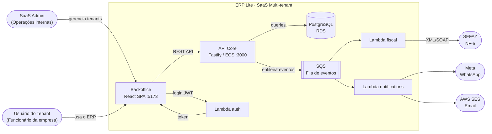
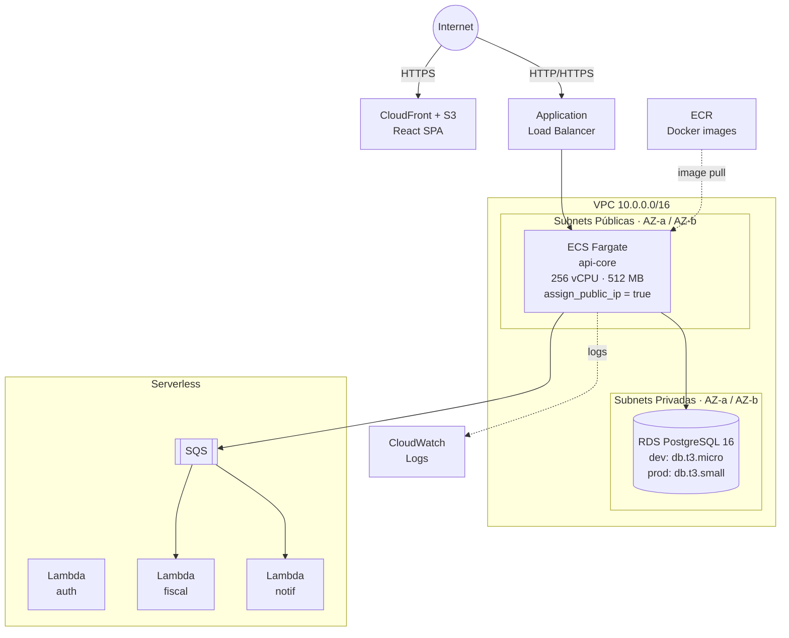
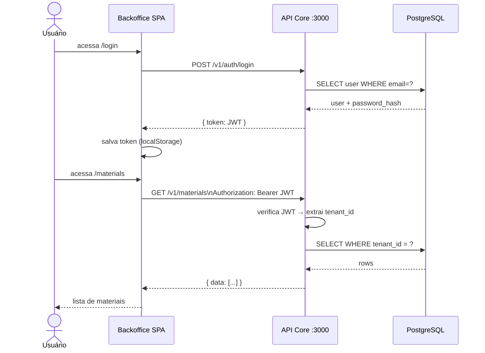

# ERP Lite — SaaS Multi-tenant ERP on AWS

> **Este README é o prompt principal para geração de código por IA.**
> Ao solicitar alterações, referencie este arquivo para que a IA entenda o contexto completo do projeto.

---

## Histórico de Prompts

### v0.1 — Kickoff
> "Novo projeto ERP SaaS, multitenant, AWS. Monorepo Fastify + Node + React.
> Lambda para serviços pontuais. Cadastro de clientes com campos: Empresa, CNPJ,
> Endereço, Telefone, Contatos (compras/manutenção/fiscal) com tel e email.
> Campos em inglês para venda global. Banco PostgreSQL."

### v0.2 — Materiais + Docker + AWS
> "Adicionar cadastro de materiais para venda de produtos e serviços com estoque.
> Iniciar abordagem para rodar localmente no Docker e estrutura para rodar na AWS
> com menor custo possível. Atualizar README como prompt para IA."

### v0.3 — Backoffice + Auth
> "Adicionar tela de login e cadastro básico para rodar localmente. Iniciar o
> cadastro de materiais e demais funcionalidades de backoffice. Auth integrada
> no api-core (login/register com bcrypt + JWT). React SPA em apps/backoffice
> com React Router, contexto de auth e páginas: Login, Register, Dashboard,
> Materials (lista + formulário). Docker Compose inclui o serviço backoffice."

---

## Visão Geral

ERP Lite é um ERP SaaS multi-tenant construído em Node.js/Fastify, com frontend
React, banco PostgreSQL, deployado na AWS com custo mínimo.

**Modelo multi-tenant:** shared database, shared schema — todas as tabelas ERP
carregam `tenant_id`. O `tenant_id` é sempre extraído do JWT (nunca do body da
requisição), garantindo isolamento por camada de aplicação.

---

## Diagramas de Arquitetura

### Contexto da Aplicação (C4 Nível 1)



---

### Infraestrutura AWS



> **Sem NAT Gateway:** ECS tasks ficam em subnet pública com `assign_public_ip = true`.
> Isso elimina o custo do NAT Gateway (~$30/mês).

---

### Fluxo de uma Requisição Autenticada



---

## Stack Tecnológica

| Camada | Tecnologia | Justificativa |
|--------|-----------|---------------|
| API principal | Node.js 20 + Fastify 4 + TypeScript | Alto throughput, baixo overhead |
| Banco de dados | PostgreSQL 16 (AWS RDS) | ACID, JSON nativo, custo previsível |
| Frontend | React 18 + Vite + TypeScript | (próximo sprint) |
| Auth | Lambda + JWT HS256 | Stateless, zero custo idle |
| Infra | Terraform + ECS Fargate | IaC reproducível |
| CI/CD | GitHub Actions | (próximo sprint) |
| Secrets | AWS Parameter Store | Nunca em env vars no ECS |

---

## Decisões de Arquitetura

### Onde usar ECS Fargate vs Lambda

| Serviço | Runtime | Motivo |
|---------|---------|--------|
| `api-core` | ECS Fargate | CRUD contínuo, latência previsível, pool de conexão DB |
| `auth` | Lambda | Stateless, baixa frequência, zero idle cost |
| `fiscal` | Lambda | NF-e é assíncrono, spiky, até 14 min — cabe em Lambda |
| `notifications` | Lambda | SQS-triggered, sem tráfego baseline |
| `reports` | Lambda | Pesado, on-demand, cabe no limite de 15 min |

### Custo mínimo AWS (sem NAT Gateway)

```
VPC (10.0.0.0/16)
├── Public Subnets  AZ-a/b  → ECS tasks + ALB
│     ECS tasks têm public IP → acessam ECR e internet sem NAT Gateway
│     Economia: ~$30/mês (sem NAT Gateway)
└── Private Subnets AZ-a/b  → RDS (sem acesso externo)

Estimativa mensal prod:
  RDS t3.micro single-AZ   ~$13
  ECS Fargate 256/512       ~$9  (1 task)
  ALB                       ~$16
  CloudFront + S3           ~$1
  CloudWatch logs           ~$2
  ──────────────────────────────
  Total mínimo              ~$41/mês
```

---

## Estrutura do Projeto

```
erp-lite/
├── docker-compose.yml              ← ambiente local completo
├── package.json                    ← monorepo npm workspaces
│
├── services/
│   └── api-core/                   ← ECS Fargate — API principal Fastify
│       ├── Dockerfile              ← multi-stage: development | builder | production
│       ├── src/
│       │   ├── index.ts            entry point
│       │   ├── app.ts              Fastify factory + registro de rotas
│       │   ├── config.ts           variáveis de ambiente
│       │   ├── db/pool.ts          pg.Pool singleton
│       │   ├── routes/
│       │   │   ├── customers.ts    CRUD /v1/customers (tenants)
│       │   │   └── materials.ts    CRUD /v1/materials + stock
│       │   └── scripts/
│       │       └── migrate.ts      runner de migrations SQL
│       └── db/migrations/
│           ├── 0001_tenants.sql
│           ├── 0002_users.sql
│           ├── 0003_materials.sql
│           └── 0004_inventory.sql
│
├── apps/
│   └── backoffice/                 ← React + Vite SPA (próximo sprint)
│
├── terraform/                      ← AWS Infrastructure as Code
│   ├── variables.tf                parâmetros de custo (instance class, desired_count)
│   ├── main.tf                     VPC, subnets, IGW, CloudWatch
│   ├── security.tf                 security groups (ALB, ECS, RDS)
│   ├── rds.tf                      RDS PostgreSQL 16
│   ├── ecs.tf                      ECS cluster, task definition, serviço, ALB
│   ├── ecr.tf                      repositório de imagens Docker
│   └── outputs.tf
│
└── scripts/                        ← scripts operacionais (próximo sprint)
```

---

## Schema do Banco de Dados

### Convenções
- Todo campo texto longo usa `TEXT`, campos curtos com limite real usam `VARCHAR(n)`
- UUIDs como PKs (`gen_random_uuid()`)
- `created_at / updated_at` em todas as tabelas; `updated_at` atualizado via trigger
- Toda tabela ERP tem `tenant_id UUID NOT NULL REFERENCES tenants(id)`
- Campos em inglês sempre (mercado global)

### `tenants` — Clientes SaaS (empresas)

| Campo | Tipo | Descrição |
|-------|------|-----------|
| `id` | UUID PK | |
| `company_name` | VARCHAR(255) | Razão social |
| `trade_name` | VARCHAR(255) | Nome fantasia |
| `tax_id` | VARCHAR(50) | CNPJ / EIN / VAT |
| `tax_id_type` | VARCHAR(10) | `CNPJ` \| `EIN` \| `VAT` \| `OTHER` |
| `street` | VARCHAR(255) | |
| `street_number` | VARCHAR(20) | |
| `complement` | VARCHAR(100) | |
| `neighborhood` | VARCHAR(100) | |
| `city` | VARCHAR(100) | |
| `state` | VARCHAR(100) | |
| `postal_code` | VARCHAR(20) | CEP / ZIP |
| `country` | CHAR(2) | ISO 3166-1 (padrão `BR`) |
| `phone` | VARCHAR(30) | Telefone principal |
| `website` | VARCHAR(255) | |
| `purchasing_contact_name/phone/email` | | Contato de compras |
| `maintenance_contact_name/phone/email` | | Contato de manutenção |
| `fiscal_contact_name/phone/email` | | Contato fiscal |
| `status` | VARCHAR(20) | `trial` \| `active` \| `suspended` \| `cancelled` |
| `plan` | VARCHAR(30) | `starter` \| `professional` \| `enterprise` |
| `trial_ends_at` | TIMESTAMPTZ | |

### `users` — Funcionários por tenant

| Campo | Tipo | Descrição |
|-------|------|-----------|
| `id` | UUID PK | |
| `tenant_id` | UUID FK | Isolamento multi-tenant |
| `email` | VARCHAR(255) | Único por tenant (não global) |
| `name` | VARCHAR(255) | |
| `password_hash` | TEXT | bcrypt (implementar no módulo auth) |
| `role` | VARCHAR(20) | `owner` \| `admin` \| `manager` \| `user` |
| `status` | VARCHAR(20) | `active` \| `disabled` |

### `materials` — Produtos e Serviços

| Campo | Tipo | Descrição |
|-------|------|-----------|
| `id` | UUID PK | |
| `tenant_id` | UUID FK | |
| `sku` | VARCHAR(100) | Único por tenant |
| `name` | VARCHAR(255) | |
| `description` | TEXT | |
| `type` | VARCHAR(20) | `product` \| `service` \| `raw_material` \| `asset` |
| `category` | VARCHAR(100) | |
| `brand` | VARCHAR(100) | |
| `unit` | VARCHAR(20) | `UN`, `KG`, `L`, `M`, `CX`, etc. |
| `sale_price` | DECIMAL(15,2) | Preço de venda |
| `cost_price` | DECIMAL(15,2) | Custo |
| `ncm_code` | VARCHAR(10) | NCM (BR) / HS Code (internacional) |
| `tax_group` | VARCHAR(50) | Grupo fiscal (uso futuro módulo fiscal) |
| `weight_kg` | DECIMAL(10,3) | Peso em kg |
| `is_active` | BOOLEAN | |
| `tracks_inventory` | BOOLEAN | `false` para serviços |

### `inventory` — Estoque atual (1 linha por material)

| Campo | Tipo | Descrição |
|-------|------|-----------|
| `material_id` | UUID FK | |
| `quantity` | DECIMAL(15,3) | Estoque atual |
| `min_qty` | DECIMAL(15,3) | Alerta de estoque mínimo |
| `max_qty` | DECIMAL(15,3) | Teto de reposição |

### `inventory_movements` — Auditoria de estoque (imutável)

| Campo | Tipo | Descrição |
|-------|------|-----------|
| `movement_type` | VARCHAR(20) | `in` \| `out` \| `adjustment` \| `return` \| `transfer` |
| `quantity` | DECIMAL(15,3) | Positivo = entrada, negativo = saída |
| `quantity_before/after` | DECIMAL(15,3) | Snapshot do estoque |
| `reference_id/type` | UUID / VARCHAR | Pedido, NF, ajuste que originou o movimento |

---

## API Reference

Base URL local: `http://localhost:3000`
Base URL prod:  `http://<ALB_DNS>` (ver `terraform output api_url`)

### Customers (tenants)

| Método | Rota | Descrição |
|--------|------|-----------|
| `POST` | `/v1/customers` | Criar cliente |
| `GET` | `/v1/customers` | Listar clientes (paginado, filtro status/search) |
| `GET` | `/v1/customers/:id` | Buscar por ID |
| `PATCH` | `/v1/customers/:id` | Atualizar |
| `DELETE` | `/v1/customers/:id` | Cancelar (soft delete) |

### Materials + Stock

| Método | Rota | Descrição |
|--------|------|-----------|
| `POST` | `/v1/materials` | Criar material (cria inventory automaticamente) |
| `GET` | `/v1/materials?tenant_id=` | Listar (filtro: type, category, active, search) |
| `GET` | `/v1/materials/:id` | Buscar por ID |
| `PATCH` | `/v1/materials/:id` | Atualizar |
| `DELETE` | `/v1/materials/:id` | Desativar (soft delete) |
| `GET` | `/v1/materials/:id/stock` | Estoque atual |
| `POST` | `/v1/materials/:id/stock/movements` | Registrar movimento (in/out/adjustment) |
| `GET` | `/v1/materials/:id/stock/movements` | Histórico de movimentos |
| `GET` | `/v1/stock/alerts?tenant_id=` | Materiais abaixo do estoque mínimo |

### Sistema

| Método | Rota | Descrição |
|--------|------|-----------|
| `GET` | `/health` | Health check (usado pelo ECS) |

---

## Desenvolvimento Local

### Pré-requisitos

| Ferramenta | Versão mínima | Para quê |
|------------|--------------|----------|
| Docker Desktop | qualquer recente | banco + API + backoffice |
| Node.js | 20+ | opcional — apenas se rodar fora do Docker |
| npm | 10+ | gerenciamento de workspaces |

---

### Subir tudo com Docker (recomendado)

```bash
# 1. Instalar dependências do monorepo
npm install

# 2. Subir PostgreSQL + API Core + Backoffice (hot-reload)
docker compose up

# 3. Rodar migrations (primeira vez ou após novas migrations)
docker compose run --rm migrate
```

| Serviço | URL local |
|---------|-----------|
| Backoffice (React SPA) | http://localhost:5173 |
| API Core (Fastify) | http://localhost:3000 |
| PostgreSQL | localhost:5432 |

> O Vite (backoffice) faz proxy de `/v1/*` e `/health` para o api-core em `:3000`,
> então a SPA não precisa configurar CORS — acesse tudo por `:5173`.

---

### Primeiro acesso — criar conta

1. Abra **http://localhost:5173**
2. Clique em **"Create your company"**
3. Preencha razão social, CNPJ, e-mail e senha (mínimo 8 caracteres)
4. Ao confirmar você já estará logado e verá o Dashboard

Para logins subsequentes acesse **http://localhost:5173/login**.

---

### Subir apenas a API (sem Docker)

```bash
# Pré-requisito: PostgreSQL acessível localmente
cd services/api-core
cp .env.example .env          # edite DATABASE_URL e JWT_SECRET
npm run migrate               # cria/atualiza tabelas
npm run dev                   # hot-reload com ts-node-dev

# Subir o backoffice separadamente (outra aba)
cd apps/backoffice
npm run dev                   # Vite em http://localhost:5173
```

---

### Comandos úteis

```bash
# Health check da API
curl http://localhost:3000/health

# Registrar empresa via API (cria tenant + usuário owner)
curl -X POST http://localhost:3000/v1/auth/register \
  -H "Content-Type: application/json" \
  -d '{
    "company_name": "Acme Ltda",
    "tax_id": "12345678000195",
    "tax_id_type": "CNPJ",
    "email": "admin@acme.com",
    "password": "senha123"
  }'
# → retorna { token, user, tenantId }

# Login
curl -X POST http://localhost:3000/v1/auth/login \
  -H "Content-Type: application/json" \
  -d '{"email":"admin@acme.com","password":"senha123"}'

# Criar material (use o tenantId retornado acima)
curl -X POST http://localhost:3000/v1/materials \
  -H "Content-Type: application/json" \
  -H "Authorization: Bearer <TOKEN>" \
  -d '{
    "tenant_id": "<TENANT_ID>",
    "sku": "PROD-001",
    "name": "Produto Teste",
    "type": "product",
    "sale_price": 99.90,
    "unit": "UN",
    "tracks_inventory": true
  }'

# Ver estoque de um material
curl http://localhost:3000/v1/materials/<ID>/stock

# Alertas de estoque mínimo
curl "http://localhost:3000/v1/stock/alerts?tenant_id=<TENANT_ID>"
```

---

### Variáveis de ambiente (api-core)

| Variável | Padrão (dev) | Descrição |
|----------|-------------|-----------|
| `DATABASE_URL` | `postgres://erp_lite:erp_lite@db:5432/erp_lite` | Connection string PostgreSQL |
| `JWT_SECRET` | `local-dev-secret` | Segredo para assinar JWTs |
| `PORT` | `3000` | Porta HTTP |
| `NODE_ENV` | `development` | Modo de execução |

---

## Deploy AWS

### Pré-requisitos
- AWS CLI configurado
- Terraform >= 1.5
- Criar bucket S3 para estado Terraform: `erp-lite-terraform-state`

### Primeira vez

```bash
# 1. Build e push da imagem
aws ecr get-login-password --region us-east-1 | \
  docker login --username AWS --password-stdin <ACCOUNT>.dkr.ecr.us-east-1.amazonaws.com

docker build -t erp-lite/api-core --target production services/api-core
docker tag  erp-lite/api-core <ECR_URL>:latest
docker push <ECR_URL>:latest

# 2. Deploy infra
cd terraform
terraform init
terraform plan  -var="db_password=SENHA_FORTE" -var="jwt_secret=JWT_SECRET"
terraform apply -var="db_password=SENHA_FORTE" -var="jwt_secret=JWT_SECRET"

# 3. Rodar migrations na AWS (usar ECS run-task — script será criado)
# terraform output api_url  →  URL pública da API
```

### Variáveis de custo (terraform/variables.tf)

| Variável | Dev | Prod | Impacto |
|----------|-----|------|---------|
| `db_instance_class` | `db.t3.micro` | `db.t3.small` | ~$14/mês |
| `api_desired_count` | `1` | `2` | HA |
| `api_cpu` | `256` | `512` | Fargate |
| `api_memory` | `512` | `1024` | Fargate |

---

## Padrões de Código

### Adicionando um novo módulo ERP

1. Criar migration em `services/api-core/db/migrations/000N_nome.sql`
   - Sempre incluir `tenant_id UUID NOT NULL REFERENCES tenants(id)`
   - Sempre incluir trigger `updated_at`
   - Adicionar índice em `(tenant_id, ...)` para toda query frequente

2. Criar rota em `services/api-core/src/routes/nome.ts`
   - Fastify JSON Schema em todas as rotas (body, params, querystring, response)
   - Paginação padrão: `page`, `per_page` (default 20, max 100)
   - Soft delete: marcar `is_active = false`, nunca deletar fisicamente
   - Transações (`pool.connect()` + BEGIN/COMMIT/ROLLBACK) para operações compostas

3. Registrar em `services/api-core/src/app.ts`
   ```typescript
   await app.register(novoModuloRoutes, { prefix: '/v1' });
   ```

4. Adicionar migration ao array em `services/api-core/src/scripts/migrate.ts`

5. Atualizar este README: schema, endpoints, roadmap

### Regras de segurança

- `tenant_id` **nunca** vem do body — sempre do JWT (`request.user.tenantId`)
  > Temporariamente no body enquanto auth Lambda não está implementado
- Senhas: bcrypt com salt rounds ≥ 12
- Segredos: AWS Parameter Store — nunca em variáveis de ambiente ECS em texto claro
- Queries: sempre `$1, $2, ...` (parametrized) — jamais concatenação de strings SQL

---

## Roadmap

| Status | Módulo | Descrição |
|--------|--------|-----------|
| ✅ | **Customers** | Cadastro de clientes/tenants |
| ✅ | **Materials** | Produtos/serviços + controle de estoque |
| ✅ | **Docker** | Ambiente local com hot-reload |
| ✅ | **Terraform** | Infra AWS mínima (ECS + RDS + ECR + ALB) |
| 🚧 | **Auth** | Login + registro via api-core (bcrypt + JWT); migrar para Lambda |
| 🚧 | **Backoffice** | React SPA — login, registro, materiais |
| 🔜 | **Users** | CRUD de usuários por tenant com roles |
| 🔜 | **CI/CD** | GitHub Actions — build, push ECR, deploy ECS |
| 🔜 | **Orders** | Pedidos de venda com baixa automática de estoque |
| 🔜 | **Purchasing** | Pedidos de compra com entrada de estoque |
| 🔜 | **Fiscal** | NF-e, SEFAZ, Lambda fiscal |
| 🔜 | **Reports** | Relatórios async via Lambda + S3 |
| 🔜 | **Notifications** | Email/WhatsApp via Lambda + SQS |
