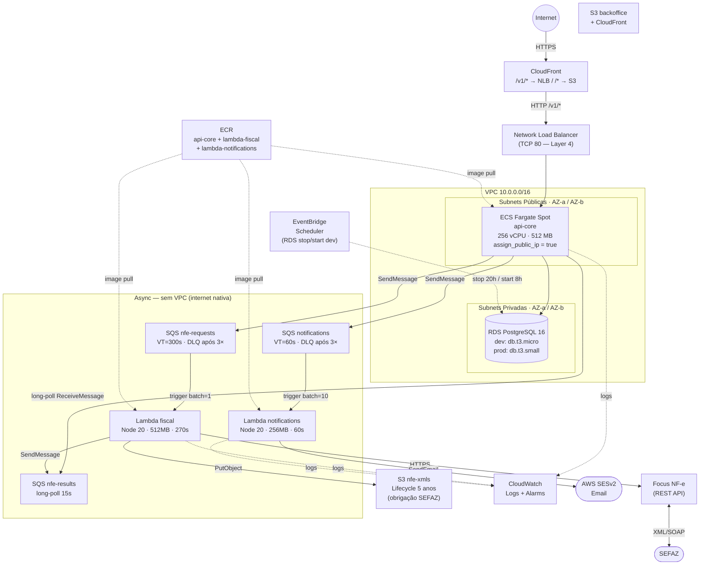
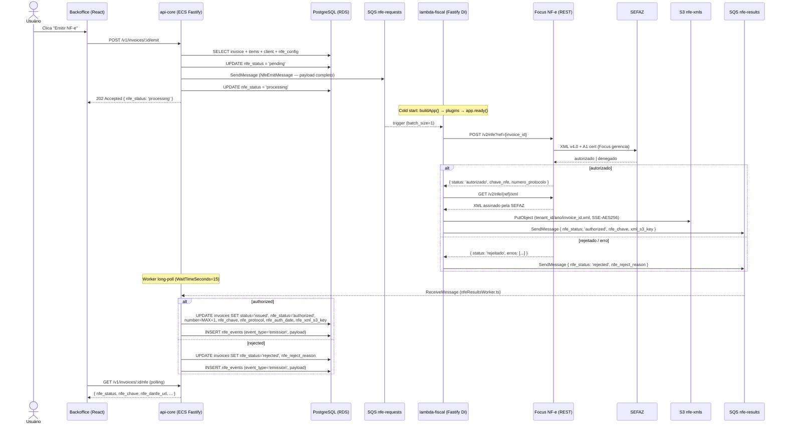

# Orquestra ERP — SaaS Multi-tenant ERP on AWS

> **Este README é o prompt principal para geração de código por IA.**
> Antes de implementar qualquer funcionalidade, leia este arquivo na íntegra.
> Ele define a fonte da verdade sobre schema, rotas, componentes e convenções.

---

## Protocolo Anti-alucinação (leia primeiro)

Regras que toda IA assistindo este projeto DEVE seguir antes de gerar código:

1. **Nunca inventar tabelas ou colunas.** O schema de banco de dados está documentado neste README e nos arquivos `services/api-core/db/migrations/000N_*.sql`. Tabelas existentes: `tenants`, `users`, `materials`, `inventory`, `inventory_movements`, `clients`, `orders`, `order_items`, `invoices`, `invoice_items`, `nfe_configs`, `nfe_events`, `notification_configs`, `receivables`, `receivable_payments`, `payables`, `payable_payments`, `boletos`, `boleto_events`. Antes de usar qualquer tabela/coluna, confirme que ela existe.

2. **Nunca inventar rotas de API.** Todas as rotas existentes estão listadas na seção "API Reference". Se uma rota não está aqui, ela não existe.

3. **Nunca inventar componentes, hooks ou classes CSS.** Os componentes React existentes estão em `apps/backoffice/src/components/` e `apps/backoffice/src/pages/`. As classes CSS existem em `apps/backoffice/src/index.css` — leia o arquivo antes de usar qualquer classe.

4. **Nunca usar `tenant_id` do body da requisição em código de produção.** O `tenant_id` vem sempre do JWT (`request.user.tenantId`). A exceção atual (tenant_id no body) é temporária enquanto o auth Lambda não está integrado.

5. **Nunca assumir que uma biblioteca está instalada** sem verificar `package.json`. O projeto usa exatamente o que está declarado em `services/api-core/package.json` e `apps/backoffice/package.json`.

6. **Sempre ler o arquivo antes de editá-lo.** Usar o conteúdo real como base — não o que você imagina que está lá.

7. **Sempre adicionar chaves de i18n nos dois arquivos:** `apps/backoffice/src/i18n/pt-BR.ts` (source of truth para `TKey`) e `apps/backoffice/src/i18n/en.ts` (deve ter todas as mesmas chaves, ou o TypeScript dará erro de compilação).

8. **Nunca deletar fisicamente registros.** Todos os soft-deletes estão documentados por módulo abaixo.

9. **Nunca concatenar strings em SQL.** As rotas usam Drizzle ORM (`db.select/insert/update/transaction`). Para SQL bruto, usar `sql\`... ${valor} ...\`` (tagged template literal do Drizzle — parametrização automática e segura). Nunca interpolar strings diretamente em queries.

10. **Ao adicionar um novo módulo**, seguir o checklist completo da seção "Adicionando um novo módulo".

11. **Nunca carregar dropdowns do drawer em event handlers.** O padrão correto é `useEffect([drawerOpen, tenantId])` com flag de cancelamento. Chamar `loadDropdowns()` de `openCreate()` cria stale-closure que não retenta quando `tenantId` resolve depois. Usar `noValidate` no `<form>` e `role="alert"` no div de erro.

12. **Nunca usar `per_page` acima de 100.** A API impõe `Math.min(per_page, 100)` em todas as rotas de listagem. Valores maiores são silenciosamente truncados para 100.

13. **Importação em lote: parsear no frontend, enviar JSON.** O padrão do projeto é usar SheetJS (`xlsx`) no browser para converter `.xlsx` em array JSON e enviar para `POST /v1/clients/import` ou `POST /v1/materials/import`. Nunca fazer upload de arquivo binário para o servidor — isso evita adicionar dependência de parser Excel no backend Fastify. O endpoint de importação usa `ON CONFLICT DO NOTHING RETURNING id` para detectar duplicatas sem lançar exceção.

14. **Cálculo de impostos: sempre usar taxEngine.ts (stateless).** O módulo `services/api-core/src/lib/taxEngine.ts` é a fonte da verdade para ICMS, PIS, COFINS de São Paulo. Ele é puro (sem I/O). O endpoint `POST /v1/tax/calculate` delega para ele. O frontend chama esse endpoint e armazena os valores calculados nos campos `icms_*`, `pis_*`, `cofins_*` dos itens antes de salvar a NF-e. ICMS/PIS/COFINS são impostos "por dentro" (embutidos no preço — não aumentam o total). IPI é "por fora" (adicionado ao total). O total da NF-e = subtotal + ipi_total.

15. **Lambda container images: sempre usar `platforms: linux/amd64` + `provenance: false`** nos steps `docker/build-push-action` do CI/CD. Sem isso, Docker Buildx gera um OCI manifest index (manifest list) que o AWS Lambda rejeita com `InvalidParameterValueException: image manifest ... not supported`. Lambda exige Docker Image Manifest V2 Schema 2 single-platform. A api-core (ECS) não precisa dessas flags — apenas as Lambdas.

16. **Nunca definir variáveis reservadas do Lambda runtime em `environment.variables` do Terraform.** O runtime do Lambda injeta automaticamente: `AWS_REGION`, `AWS_DEFAULT_REGION`, `AWS_ACCESS_KEY_ID`, `AWS_SECRET_ACCESS_KEY`, `AWS_SESSION_TOKEN`, `AWS_LAMBDA_FUNCTION_NAME`, `AWS_LAMBDA_FUNCTION_VERSION`, `AWS_LAMBDA_FUNCTION_MEMORY_SIZE`, `LAMBDA_TASK_ROOT`, `LAMBDA_RUNTIME_DIR`. Tentar definir qualquer uma delas resulta em `InvalidParameterValueException: environment variables contains reserved keys`. O código acessa `process.env.AWS_REGION` normalmente — o valor já está disponível em runtime sem configuração manual.

17. **O arquivo `GaxLogo.tsx` é o logo Orquestra ERP.** O arquivo mantém o nome antigo para não quebrar imports. O componente renderiza a identidade visual Orquestra ERP: arco 270° com gradiente `#3B5CE4→#00B4D8`, nó central, dois braços com pontos, wordmark "Orquestra" + subtítulo "ERP". **Não recriar nem renomear o arquivo.** Tamanhos: `sm=28`, `md=36`, `lg=48`, `xl=64`, `xxl=88` (px de altura). Na LoginPage: hero usa `size="xxl"`, formulário usa `size="xl"`.

18. **Domínio público: `orquestraerp.com.br`.** Route 53 hosted zone provisionada (`terraform/dns.tf`). Aliases CloudFront e certificado ACM (us-east-1) ativados. A URL pública de produção é `https://orquestraerp.com.br`. Nunca usar o domínio `*.cloudfront.net` como URL pública para o usuário final.

19. **Variáveis CSS foram atualizadas para o tema Orquestra ERP.** Paleta atual em `apps/backoffice/src/index.css`: `--primary: #3B5CE4` (azul Orquestra), `--primary-h: #2945C8`, `--accent: #00B4D8` (ciano). Nunca usar cores da identidade anterior (ex: `--primary: #2563eb`). Todas as classes CSS existentes continuam válidas — apenas os valores das variáveis mudaram.

20. **PostgreSQL `ALTER TABLE` multi-coluna: nunca usar parênteses.** A sintaxe `ADD COLUMN (col1 type, col2 type)` é MySQL — o PostgreSQL a rejeita com `syntax error at "("` (código `42601`). A forma correta é uma cláusula `ADD COLUMN` por coluna separada por vírgula, sem parênteses englobante:
    ```sql
    -- ✅ PostgreSQL correto
    ALTER TABLE minha_tabela
      ADD COLUMN coluna1 VARCHAR(10),
      ADD COLUMN coluna2 TEXT,
      ADD COLUMN coluna3 INT NOT NULL DEFAULT 0;

    -- ❌ Inválido no PostgreSQL (sintaxe MySQL)
    ALTER TABLE minha_tabela ADD COLUMN (
      coluna1 VARCHAR(10),
      coluna2 TEXT
    );
    ```

---

## Histórico de Prompts

### v3.0 — Módulo de Cobrança (Boleto) + Dados Bancários + lambda-billing

> **Módulo de cobrança assíncrona via SQS + Lambda:**
> Novo serviço `services/lambda-billing/` (mesmo padrão Fastify DI dos demais Lambdas).
> Fluxo: `POST /v1/receivables/:id/emit-boleto` (api-core, 202) → draft boleto criado em DB
> (status=`pending`, `receivables.boleto_id` setado imediatamente para idempotência) →
> SQS `billing-requests` → lambda-billing → API Banco → SQS `billing-results` →
> boletoResultsWorker (ECS long-poll 15s) → UPDATE boletos + INSERT boleto_events + e-mail via SES.
>
> **Padrão "full payload no SQS":** `BillingEmitMessage` contém todos os dados necessários
> (boleto_id, receivable_id, tenant_id, amount, due_date, banking config completo). O Lambda
> nunca acessa RDS — mesmo princípio do lambda-fiscal. Idempotência garantida pelo draft boleto
> criado antes do enqueue; rollback duplo (DELETE boleto + unset receivable.boleto_id) se SQS falha.
>
> **Multi-banco — adapter pattern:** `src/plugins/banks.ts` implementa `getAdapter(bank_code)`.
> Itaú (341) é o primeiro adapter: OAuth2 `client_credentials`, token cacheado entre warm invocations
> com refresh 60s antes da expiração, POST `/cobrancas/v2/boletos` com `etapa_processo_boleto=efetivacao`,
> `id_beneficiario` = dados bancários do tenant. Novos bancos: adicionar case no switch.
>
> **Novos campos em `tenants`** (migration 0014): `bank_code`, `agency`, `account`, `account_digit`,
> `billing_provider`, `billing_days_to_expire`, `banking_updated_at`.
>
> **Novas tabelas:** `boletos` (estado do boleto, nosso_numero, brcode, boleto_url, expires_at)
> e `boleto_events` (audit trail imutável — `generated`, `paid`, `expired`, `error`).
>
> **Nova coluna:** `receivables.boleto_id UUID FK → boletos` (link 1:1 para acesso direto ao boleto).
>
> **Notificação `boleto_generated`:** tipo novo em lambda-notifications + template HTML/texto
> com link do boleto e PIX copia e cola. Coluna `notify_boleto_generated BOOLEAN DEFAULT false`
> adicionada em `notification_configs` (migration 0014).
>
> **Tela de Dados Bancários:** aba "Dados Bancários" em `apps/backoffice/src/pages/company/CompanyPage.tsx`
> com campos banco, agência, conta, dígito, provedor e dias para vencer.
>
> **Seção Boleto em Contas a Receber:** botão "Emitir Boleto" no drawer de detalhes;
> exibe status, nosso número, botão "Ver Boleto" e "Copiar PIX (Copia e Cola)" quando emitido.
>
> **Terraform:** `billing.tf` (Lambda + IAM + event source mapping), `s3-billing.tf`
> (bucket PDFs com lifecycle 7 anos), queues billing-dlq/requests/results em `sqs.tf`,
> repo lambda-billing em `ecr.tf`, variáveis `itau_client_id`/`itau_client_secret` em `variables.tf`.
>
> **CI/CD:** step de build/push `lambda-billing` em `.github/workflows/deploy.yml`.
> Novos secrets: `TF_VAR_ITAU_CLIENT_ID`, `TF_VAR_ITAU_CLIENT_SECRET`.
>
> **Custo:** Lambda (pay-per-request, ~$0 a baixo volume) + 3 SQS queues + S3 DEEP_ARCHIVE após 1 ano.
> Sem custo fixo adicional para o serviço de cobrança.

### v2.3 — Domínio personalizado orquestraerp.com.br

> **Route 53:** hosted zone `orquestraerp.com.br` provisionada em `terraform/dns.tf`.
> Nameservers (ns-1170.awsdns-18.org, ns-315.awsdns-39.com, ns-748.awsdns-29.net,
> ns-1678.awsdns-17.co.uk) configurados no Registro.br.
>
> **ACM:** certificado `arn:aws:acm:us-east-1:016054712606:certificate/f9f5dcac-004e-4c81-adca-01f6292beef6`
> em us-east-1 (obrigatório para CloudFront). Validado via DNS (CNAMEs no Route 53 com `allow_overwrite=true`).
>
> **CloudFront (Phase 2):** aliases `orquestraerp.com.br` + `www.orquestraerp.com.br` e certificado ACM
> configurados via console AWS após cert ISSUED. `lifecycle { ignore_changes = [viewer_certificate, aliases] }`
> removido do `terraform/static.tf` após ativação manual.
>
> **Terraform:** `terraform/dns.tf` (zona + CNAMEs de validação ACM + registros A alias para CloudFront),
> variável `acm_certificate_arn` em `variables.tf`, output `app_url` + `route53_nameservers` em `outputs.tf`.
> Novo secret GitHub: `TF_VAR_ACM_CERTIFICATE_ARN`.
>
> **URL pública de produção:** `https://orquestraerp.com.br`.
>
> **Erro contornado — `InvalidChangeBatch: already exists`:** deploy inicial criou os CNAMEs de validação
> ACM e travou antes de persistir o estado Terraform. Re-deploy tentou recriar os registros.
> Fix: `allow_overwrite = true` nos dois `aws_route53_record` de validação.
>
> **Erro contornado — `InvalidViewerCertificate` (CloudFront):** deploy inicial atualizou CloudFront
> com aliases + cert PENDING antes de travar. Tentativas seguintes falhavam porque a AWS valida
> o cert contra os aliases ATUAIS antes de aplicar qualquer update.
> Fix: `lifecycle { ignore_changes = [viewer_certificate, aliases] }` + ativação manual via console
> após cert ISSUED + remoção do lifecycle na Phase 2.

### v2.2 — Orquestra ERP — Rebrand completo

> **Novo nome:** GAX ERP → **Orquestra ERP**.
>
> **Nova identidade visual:**
> - **Logo** em `apps/backoffice/src/components/GaxLogo.tsx` (arquivo mantém nome para não quebrar imports):
>   arco SVG 270° com gradiente `#3B5CE4→#00B4D8`, nó central (r=3.2), dois braços com pontos terminais,
>   wordmark "Orquestra" (fontWeight 800) + subtítulo "ERP" (letterSpacing 4, cor `#00B4D8`).
>   Tamanhos: `sm:28 md:36 lg:48 xl:64 xxl:88` (px). LoginPage: hero `size="xxl"`, form `size="xl"`.
> - **Paleta CSS** em `apps/backoffice/src/index.css`: `--primary: #3B5CE4`, `--primary-h: #2945C8`,
>   `--accent: #00B4D8`, `--bg: #F2F5FB`, `--text: #0D1B2A`.
> - **`index.html`:** título "Orquestra ERP" + meta description.
> - **i18n:** `l.subtitle` atualizado em pt-BR.ts e en.ts. `LS_KEY = 'orquestra-lang'` em i18n/index.tsx.

### v2.1 — Node.js 22 (Lambda runtime)

> Lambda fiscal e lambda-notifications: Node.js 20 → 22 em todos os estágios Dockerfile
> (development `node:22-alpine`, builder `public.ecr.aws/lambda/nodejs:22`, production `public.ecr.aws/lambda/nodejs:22`).
> Motivo: AWS SDK v3 emite `NodeVersionSupportWarning` para Node < 22. Suporte a Node 20 encerra em 2027.

### v2.0 — Contas a Pagar/Receber + Controle de Estoque + Logo da Empresa

> **Módulos financeiros (Receivables e Payables):**
> Tabelas `receivables` (status: `pending→partial→paid|overdue|cancelled`) e `receivable_payments`
> (append-only), `payables` e `payable_payments`. Máquina de estados controlada pelo backend:
> pagamento parcial = `partial`; `paid_amount >= amount` = `paid`; estorno recalcula totals.
> Auto-criação de receivable ao emitir NF-e (via `db.transaction` em `invoices.ts`).
>
> **Controle de Estoque dedicado (`StockPage`):**
> Aba "Posição de Estoque" (tabela global c/ badge de alerta), aba "Histórico de Movimentos"
> com filtros por tipo/data. Drawer de ajuste rápido reutiliza `POST /v1/materials/:id/stock/movements`.
> Dois endpoints novos em `materials.ts`: `GET /v1/stock` (posição global) e
> `GET /v1/stock/movements` (histórico global com filtros), com JWT auth via `(app as any).authenticate`.
>
> **Logo da empresa:**
> Coluna `logo_url TEXT` em `tenants` (migration 0011). Logo armazenado como data URI base64
> (máx 300 KB). `PUT /v1/tenant/logo` valida MIME prefix e `Buffer.byteLength`.
> Logo NÃO incluído no `/auth/me` — carregado apenas na `CompanyPage` sob demanda.
>
> **Novas rotas:** `GET|PATCH /v1/tenant`, `PUT|DELETE /v1/tenant/logo`,
> `GET|POST|PATCH|DELETE /v1/receivables(/:id)?(/payments/:pid)?`,
> `GET|POST|PATCH|DELETE /v1/payables(/:id)?(/payments/:pid)?`,
> `GET /v1/stock`, `GET /v1/stock/movements`.
>
> **SaaS security:** todos os endpoints extraem `tenantId` do JWT — nunca do body.
> Operações de pagamento verificam ownership do parent antes de proceder.
>
> **i18n:** namespaces `stk.*`, `rec.*`, `pay.*`, `comp.*` adicionados em pt-BR.ts e en.ts.

### v0.1 — Kickoff
> Novo projeto ERP SaaS, multitenant, AWS. Monorepo Fastify + Node + React.
> Lambda para serviços pontuais. Cadastro de clientes com campos: Empresa, CNPJ,
> Endereço, Telefone, Contatos (compras/manutenção/fiscal) com tel e email.
> Campos em inglês para venda global. Banco PostgreSQL.

### v0.2 — Materiais + Docker + AWS
> Adicionar cadastro de materiais para venda de produtos e serviços com estoque.
> Iniciar abordagem para rodar localmente no Docker e estrutura para rodar na AWS
> com menor custo possível. Atualizar README como prompt para IA.

### v0.3 — Backoffice + Auth
> Adicionar tela de login e cadastro básico para rodar localmente. Auth integrada
> no api-core (login/register com bcrypt + JWT). React SPA em apps/backoffice
> com React Router, contexto de auth e páginas: Login, Register, Dashboard, Materials.

### v0.4 — Identidade visual GAX + Módulo Clientes (PJ/PF)
> Empresa se chama GAX. Criar logo moderno para a tela de login. Implementar
> migrations básico para rodar localmente. No cadastro de clientes prever que
> uma empresa pode emitir NF-e para CNPJ e CPF — adicionar campos necessários.

### v0.5 — Globalização pt-BR + CNPJ fix + CI/CD + Users CRUD
> Globalizar todas as labels para português-BR com toggle EN. Corrigir validação
> de CNPJ (peso inicial era n-7, correto é n-8). GitHub Actions CI/CD pipeline.
> CRUD de usuários por tenant com roles. Fix: login case-insensitive + seed script.

### v0.6 — Pedidos de Venda + Notas Fiscais
> Telas de gestão de pedidos (Pedidos de Venda com baixa automática de estoque,
> status: draft→confirmed→invoiced→delivered|cancelled) e Notas Fiscais
> (draft→issued|cancelled, geração sequencial de número por série, vínculo com pedido).
> README reescrito como prompt anti-alucinação com protocolo de uso para IA.

### v0.7 — Deploy AWS end-to-end + Mixed Content fix + i18n completo
> Pipeline CI/CD totalmente funcional na AWS: GitHub Actions → ECR → Terraform →
> ECS Fargate + RDS PostgreSQL 16 + CloudFront/S3. Correções aplicadas durante
> o processo: descrições de security group em ASCII, migrations pós-apply, OAC
> S3 com BucketOwnerEnforced + depends_on, senha RDS auto-gerada via
> `random_password` (charset URL-safe + `urlencode()`), SSL obrigatório no
> PostgreSQL 16, script de migrations compilado (sem ts-node em prod). Fix
> principal: Mixed Content eliminado roteando `/v1/*` pelo CloudFront (HTTPS
> viewer → HTTP ALB interno), unificando o domínio público em HTTPS. Tela de
> cadastro de empresa traduzida para pt-BR via namespace `r.*`.

### v0.9 — Cost optimisation: NLB + Fargate Spot
> Duas mudanças de infra Terraform sem impacto em código de aplicação.
> **NLB substitui ALB**: mesmo custo base ($0.008/hora) mas capacidade-unit 8×
> mais barata (NLCU vs LCU). Para MVP de baixo tráfego, o ALB cobrava LCUs extras
> por avaliação de regras L7; o NLB TCP puro elimina esse overhead.
> **Fargate Spot substitui Fargate regular**: `launch_type = "FARGATE"` substituído
> por `capacity_provider_strategy` com FARGATE_SPOT (peso 4) e FARGATE como fallback
> automático (peso 1). Spot tem ~70% de desconto; ECS faz o failover transparente
> se a capacidade Spot for interrompida.
> CloudWatch log retention reduzido de 30 → 14 dias em prod (sem impacto operacional).
> NLB SG: regra HTTPS 443 removida (CloudFront já termina HTTPS — NLB só precisa de 80).
> Economia estimada: **$9–14/mês** (~$38 → ~$24–29).
> **Nota:** `terraform apply` destrói o ALB e recria como NLB — ~2 min de downtime
> esperado durante o apply. Aceitável para MVP.

### v1.4 — Lambda notifications + LocalStack dev environment
> Novo microserviço `services/lambda-notifications/` (mesmo padrão Fastify DI do lambda-fiscal)
> responsável pelo envio de e-mails transacionais multi-tenant via AWS SESv2.
>
> **Multi-tenant, e-mail individual:** cada mensagem SQS contém o destinatário já resolvido pelo
> `api-core` (sem acesso a DB no Lambda). O `notificationsClient.ts` consulta `notification_configs`
> antes de enfileirar — silencioso quando desabilitado ou sem configuração.
>
> **Eventos cobertos:** `nfe_authorized` (NF-e autorizada pela SEFAZ, inclui chave e link DANFE),
> `nfe_rejected` (motivo da rejeição, ação necessária), `order_confirmed` (pedido confirmado, total).
>
### v1.6 — Fix Lambda container image manifest + reserved env var AWS_REGION

> **Erro 1 — `aws_lambda_function.fiscal_nfe`:** `InvalidParameterValueException: The image manifest,
> config or layer media type for the source image ... is not supported.`
>
> Causa: `docker/build-push-action@v5` com Docker Buildx gera por padrão um **OCI manifest index**
> (manifest list com provenance attestation). AWS Lambda não suporta manifest lists — exige
> **Docker Image Manifest V2 Schema 2** single-platform.
>
> Fix em `.github/workflows/deploy.yml` nos dois steps de build de Lambda:
> - `platforms: linux/amd64` — força build single-platform
> - `provenance: false` — desativa a provenance attestation que gera o manifest list
>
> **Erro 2 — `aws_lambda_function.notifications`:** `InvalidParameterValueException: environment
> variables contains reserved keys: AWS_REGION`
>
> Causa: `terraform/notifications.tf` definia `AWS_REGION = var.aws_region` no bloco
> `environment.variables`. `AWS_REGION` é uma variável reservada do Lambda runtime — injetada
> automaticamente pela AWS, nunca pode ser sobrescrita via Terraform.
>
> Fix em `terraform/notifications.tf`: removida a linha `AWS_REGION = var.aws_region`.
> O `process.env.AWS_REGION` no código da Lambda continua funcionando normalmente.

### v1.5 — Drizzle ORM migration + Terraform S3 fix

> **Drizzle ORM:** migração completa de todos os `pool.query()` para Drizzle query builder
> em `services/api-core/`. Sem dependência nova de runtime (wraps o `pg.Pool` existente).
>
> **Arquivos novos:**
> - `src/db/schema.ts` — 13 tabelas como `pgTable()` (fonte de verdade dos tipos TypeScript)
> - `src/db/index.ts` — exporta `db = drizzle(pool, { schema })` e re-exporta `pool`
> - `drizzle.config.ts` — configuração drizzle-kit para introspection e generate
> - `vitest.config.ts` — configuração Vitest (substitui Jest/ts-jest)
>
> **Padrões adotados:** `db.select/insert/update` para CRUD simples; `db.execute(sql\`...\`)`
> para JOINs complexos/WHERE dinâmico; `db.transaction(async tx => { ... })` substituindo
> `pool.connect()` + `BEGIN/COMMIT/ROLLBACK` manual; `tx.execute(sql\`SELECT ... FOR UPDATE\`)`
> para locking pessimista. `calcTotals` exportado de `orders.ts` para unit testing.
>
> **Testes:** Jest/ts-jest removidos; Vitest + 3 test files + 19 testes unitários.
> `vi.hoisted()` para variáveis em `vi.mock()` factories; `vi.mock('../db/index', ...)`
> para isolar o banco nos testes. `SendMessageCommand.input.MessageBody` (AWS SDK v3 pattern).
>
> **Terraform fix:** `storage_class = "GLACIER_DEEP_ARCHIVE"` corrigido para `"DEEP_ARCHIVE"`
> em `terraform/s3-nfe.tf`. O provider Terraform AWS usa `DEEP_ARCHIVE`; `GLACIER_DEEP_ARCHIVE`
> é o nome da AWS API — os dois diferem e o provider não aceita o nome AWS.

### v1.4 — Lambda notifications + LocalStack dev environment

> **Novo microserviço `services/lambda-notifications/`** (mesmo padrão Fastify DI do lambda-fiscal)
> responsável pelo envio de e-mails transacionais multi-tenant via AWS SESv2.
>
> **Terraform:** novo `notifications.tf` (Lambda + IAM SQS+SES + CW Log Group + event source mapping),
> duas novas filas SQS (`notifications` + `notifications-dlq`) em `sqs.tf`,
> novo ECR repo `lambda-notifications` em `ecr.tf`. Novas variáveis: `ses_from_email`, `ses_from_name`,
> `lambda_notifications_image_tag`. Novos secrets CI/CD: `TF_VAR_SES_FROM_EMAIL`, `TF_VAR_SES_FROM_NAME`.
>
> **LocalStack dev environment:** `docker-compose.yml` totalmente atualizado com serviço `localstack`
> (SQS + S3 + SES emulados, free tier) e dois serviços de local runner que simulam os triggers SQS→Lambda.
> Script `scripts/localstack-init.sh` cria filas e bucket automaticamente via init hook do LocalStack.
> Variável `AWS_ENDPOINT_URL=http://localstack:4566` propagada para `api-core`, `lambda-fiscal` e
> `lambda-notifications`. E-mails capturados localmente em `http://localhost:4566/_localstack/ses`.
>
> **Bug corrigido:** `services/lambda-fiscal/Dockerfile` usava `npm ci` sem `package-lock.json`
> comprometido no contexto Docker do serviço. Corrigido para `npm install` em todos os estágios.
> Adicionado estágio `development` nos Dockerfiles de ambas as Lambdas (`node:20-alpine` + `ts-node`).
>
> **Novo banco:** tabela `notification_configs` por tenant (email_enabled, from_name, reply_to,
> toggles por tipo: notify_nfe_authorized, notify_nfe_rejected, notify_order_confirmed).
> Migration `0010_notification_configs.sql`.

### v1.3 — Lambda fiscal NF-e + Focus NF-e async emission
> Novo microserviço `services/lambda-fiscal/` (Node 20, ECR container) responsável por
> emitir NF-e via Focus NF-e REST API de forma assíncrona, com observabilidade via
> X-Ray + CloudWatch e resiliência via SQS DLQ + retry.
>
> **Padrão "full payload no SQS":** `api-core` serializa todos os dados da NF-e
> (`NfeEmitMessage`) na mensagem SQS. O Lambda nunca acessa o RDS — elimina a necessidade
> de NAT Gateway (~$32/mês economizados). Lambda sem VPC → internet pública → Focus NF-e.
>
> **Fluxo:** `POST /v1/invoices/:id/emit` (api-core, 202) →
> SQS `nfe-requests` → Lambda fiscal → Focus NF-e → SEFAZ →
> S3 (XML assinado, lifecycle 5 anos SEFAZ) → SQS `nfe-results` →
> Worker ECS long-poll (15s) → UPDATE invoices + INSERT nfe_events → GET status em tempo real.
>
> **Terraform:** `sqs.tf` (3 filas + DLQ alarm), `s3-nfe.tf` (bucket + lifecycle S3 IA →
> DEEP_ARCHIVE 5 anos), `lambda.tf` (função + event source mapping + CW alarm),
> `ecr.tf` (repo lambda-fiscal), `ecs.tf` + `variables.tf` (novos env vars + focus_nfe_token).
>
> **CI/CD:** step paralelo de build/push `lambda-fiscal` no deploy.yml. Novo GitHub Secret
> `TF_VAR_FOCUS_NFE_TOKEN` necessário (token da conta Focus NF-e — https://focusnfe.com.br).
>
> **Novo banco:** tabela `nfe_configs` (dados do emitente por tenant), colunas NF-e em
> `invoices` (nfe_status, nfe_chave, nfe_protocol, nfe_auth_date, nfe_xml_s3_key, nfe_danfe_url),
> tabela `nfe_events` (audit trail: emissões, cancelamentos, correções).
>
> **Status flow:** `null` → `pending` (emit clicked) → `processing` (Lambda consumiu)
> → `authorized` (SEFAZ aprovou, gera número sequencial NF-e) | `rejected` (SEFAZ rejeitou).

### v1.2 — Cost optimisation: Remove Multi-AZ + RDS auto-stop scheduler (dev)
> Duas mudanças Terraform sem impacto em código de aplicação. Economia total: ~**$19/mês**.
>
> **Remove Multi-AZ (P1):** `multi_az` migrado de `var.environment == "prod"` para a
> nova variável `var.rds_multi_az` (default `false`). Multi-AZ duplica o custo do RDS
> sem benefício real para um MVP — o RPO/RTO do backup diário (7 dias de retenção) é
> suficiente neste estágio. Economia: ~**$11/mês** em prod. Para reativar Multi-AZ quando
> o SLA exigir < 1 min de RTO: `terraform apply -var="rds_multi_az=true"`.
>
> **Scheduler auto-stop dev (P2):** novo arquivo `terraform/scheduler.tf` cria dois
> EventBridge Schedules (non-prod only): para RDS às 20h Brasília (stop) e às 08h Brasília
> (start), segunda a sexta. Reduz horas ativas de 720 → 260 h/mês (~64% menos). Economia:
> ~**$8/mês** no ambiente dev. Fim de semana: DB permanece parado (< limite de 7 dias da AWS
> para stop manual). Para acesso fora do horário:
> `aws rds start-db-instance --db-instance-identifier erp-lite-postgres-dev`
>
> **P3 (Reserved Instances):** ação manual no Console AWS Billing → Reservations.
> Compromisso de 1 ano em `db.t3.micro` = 35–40% de desconto adicional (~$4/mês).
>
> **P4 (Aurora Serverless v2) e P5 (Lambda):** analisados e descartados para este MVP.
> Aurora Serverless v2 com min_capacity=0 é mais caro que RDS t3.micro single-AZ quando
> o sistema fica ativo > 6h/dia. Lambda requer NAT Gateway para DB privado (cancela
> economia) ou tornar o RDS público (risco de segurança). Nenhum dos dois vale para o
> perfil de uso atual.

### v1.1 — Importação de materiais + Motor de cálculo de impostos SP (Avalara-pattern)
> **Importação de materiais:** mesmo padrão da importação de clientes. `POST /v1/materials/import`
> aceita array JSON de até 500 linhas; SKU duplicado → ignorado com `ON CONFLICT DO NOTHING`.
> MaterialsPage recebe botão "↑ Importar" e modal 4-fases igual ao de clientes.
> Modelo de planilha com 12 colunas gerado pelo frontend via SheetJS.
>
> **Motor de impostos SP:** módulo puro `services/api-core/src/lib/taxEngine.ts` com
> `calculateTaxes(TaxTransaction): TaxResult`. Rates: ICMS interno SP 12%; interstate
> SP→SE/Sul/CO 12%, SP→N/NE/ES 7%. PIS/COFINS: Lucro Presumido 0.65%/3.00%, Lucro Real
> 1.65%/7.60%, Simples/MEI 0% (DAS). CST: `00`/`40` (LP/LR), CSOSN `102`/`400` (Simples).
> `POST /v1/tax/calculate` expõe o engine via REST.
> Migration `0008_invoice_taxes.sql`: adiciona `tax_regime`, `origin_state`, `icms_total`,
> `pis_total`, `cofins_total` em `invoices`; adiciona colunas `icms_*`, `pis_*`, `cofins_*`,
> `ipi_*` em `invoice_items` (armazenamento para NF-e).
> InvoicesPage: seletor de regime tributário + UF destino + botão "Calcular Impostos" +
> painel de breakdown fiscal (ICMS/PIS/COFINS embutidos com CST e alíquota).
> Regras 13 e 14 atualizadas no Protocolo Anti-alucinação.

### v1.0 — Importação de clientes via planilha Excel
> Funcionalidade de importação em lote no módulo de Clientes.
> Estratégia: parsing do `.xlsx` no browser via SheetJS (`xlsx` 0.18.x) — sem upload de
> arquivo no servidor. O frontend converte as linhas em JSON e envia para o novo endpoint
> `POST /v1/clients/import` (máx 500 linhas). O backend processa linha a linha, com
> `ON CONFLICT DO NOTHING` para ignorar duplicados (CNPJ/CPF já cadastrados) sem
> interromper o restante. Retorna `{ imported, skipped, errors: [{ row, message }] }`.
> Frontend: botão "↑ Importar" no page-header da ClientsPage. Modal centralizado com
> 4 fases: `idle` (layout das colunas + download do modelo) → `preview` (tabela com
> N linhas encontradas) → `importing` (spinner) → `done` (resultado por linha).
> Modelo de planilha com 23 colunas gerado pelo próprio frontend via SheetJS.
> Regra 13 adicionada ao Protocolo Anti-alucinação.

### v0.8 — Fix dropdowns OrdersPage + InvoicesPage + testes unitários
> Causa raiz dos dropdowns vazios em ambas as telas: `loadDropdowns()` era chamado
> de event handlers com guarda `ddLoading` que impedia retentativas quando `tenantId`
> resolvia depois da abertura do drawer. Fix: substituído por `useEffect([drawerOpen,
> tenantId])` com flag de cancelamento e erros surfaced em `formError` (nenhum `catch`
> silencioso). `per_page` corrigido para 100 (limite da API). `noValidate` adicionado
> ao `<form>` para que a validação JS rode em vez da validação nativa do browser.
> InvoicesPage adicional: o filtro `status=confirmed` no dropdown de pedidos impedia
> vincular pedidos em rascunho; substituído por todos os pedidos não-cancelados/entregues.
> `handleOrderChange` agora limpa cliente e itens ao desselecionar um pedido.
> Infra de testes: Vitest + React Testing Library + 23 testes unitários para OrdersPage
> cobrindo lista, drawer/formulário, gerenciamento de itens e submissão (sucesso + erro).

---

## Visão Geral

**GAX Enterprise** é um ERP SaaS multi-tenant construído em Node.js/Fastify,
com frontend React (identidade visual GAX), banco PostgreSQL, deployado na AWS
com custo mínimo.

**Modelo multi-tenant:** shared database, shared schema — todas as tabelas ERP
carregam `tenant_id`. O `tenant_id` é sempre extraído do JWT (nunca do body da
requisição), garantindo isolamento por camada de aplicação.

---

## Diagramas de Arquitetura

### Contexto (C4 Nível 1)


### Infraestrutura AWS



> **Sem NAT Gateway:** ECS tasks ficam em subnet pública com `assign_public_ip = true`.
> Lambda fiscal opera fora da VPC — acessa internet (Focus NF-e), S3 e SQS nativamente.
> Economia: ~$30/mês vs abordagem com NAT Gateway.
> **Fargate Spot:** ECS service usa `capacity_provider_strategy` com FARGATE_SPOT (peso 4)
> e FARGATE como fallback automático (peso 1). Spot tem ~70% de desconto.
> **NLB:** substitui o ALB para cortar custo de LCU. Camada 4 (TCP) — sem features L7.
> **Single-AZ RDS:** `rds_multi_az = false` por padrão. Economia: ~$11/mês.
> **Scheduler dev:** EventBridge para parar o RDS às 20h e iniciar às 8h (seg–sex, Brasília).
> Dev RDS fica ativo ~260 h/mês em vez de 720 h. Economia: ~$8/mês no ambiente dev.
> **Lambda concurrency=5:** previne sobrecarga do Focus NF-e / SEFAZ em bursts.
> **DLQ alarm:** qualquer mensagem na nfe-dlq (3 falhas) dispara alarme CloudWatch.

### Sequência — Emissão NF-e Async



---

## Stack Tecnológica

| Camada | Tecnologia | Versão | Justificativa |
|--------|-----------|--------|---------------|
| API HTTP | Node.js + Fastify + TypeScript | 20 / 4.x / 5.x | Alto throughput, schemas JSON nativos, plugin system |
| Lambda | Fastify como DI + pino + TypeScript | 4.x / 5.x | Mesmo modelo de plugins do api-core, sem HTTP listen |
| ORM | Drizzle ORM (`drizzle-orm` + `drizzle-kit`) | ^0.36.0 / ^0.27.0 | Type-safe, wraps pg.Pool existente, zero overhead |
| Banco | PostgreSQL | 16 (RDS) | ACID, UUID nativo, triggers |
| Testes | Vitest + @vitest/coverage-v8 | ^2.1.0 | Substitui Jest; `vi.mock`, `vi.hoisted`, ESM-nativo |
| Frontend | React + Vite + TypeScript | 18 / 5.x / 5.x | SPA com proxy de API |
| Auth | bcryptjs (salt 12) + @fastify/jwt (HS256 24h) | — | Stateless |
| NF-e | Focus NF-e REST API | v2 | XML 4.0 + cert A1 + SEFAZ gerenciados pelo provider |
| i18n | Context API customizado | — | pt-BR padrão, EN toggle |
| Infra | Terraform + ECS Fargate | ≥ 1.5 | IaC reproduzível |
| CI/CD | GitHub Actions | — | Build ECR (api-core + lambda-fiscal) → Terraform → Migrate |

---

## Princípios de Arquitetura

### Abordagem: DDD tático + Clean Architecture (adaptada para monolito modular)

Este projeto segue os princípios de **Domain-Driven Design (DDD)** tático e
**Clean Architecture** adaptados para a escala de um MVP. A estratégia é um
monolito modular (não distribuído) com fronteiras de domínio bem definidas.
À medida que a carga escala, cada módulo pode ser extraído para um serviço
independente sem reescrever a lógica de negócios.

#### Camadas (de dentro para fora)

```
Domain          ← Entidades, Value Objects, regras de negócio puras (sem I/O)
  │
Application     ← Casos de uso, orquestração, chamadas de porta (sem frameworks)
  │
Infrastructure  ← Implementações: Postgres (pg), SQS, S3, Focus NF-e, Fastify
  │
Interface       ← Rotas HTTP Fastify, Workers SQS, Lambda handlers
```

**No código atual, o mapeamento é:**

| Camada | Localização |
|--------|-------------|
| **Domain** | `src/lib/taxEngine.ts` (cálculo de impostos — puro, sem I/O). Value Objects: campos `cnpj`, `cpf`, `nfe_chave` como VARCHAR com invariantes verificadas em SQL (CHECK). |
| **Application** | Lógica de orquestração dentro das rotas Fastify (ex: `nfe.ts` — validação de pré-condições, sequência emit → mark pending → SQS → mark processing) e `nfeResultsWorker.ts` (poll → process → update). |
| **Infrastructure** | `src/db/pool.ts` (pg.Pool), `src/lib/sqsClient.ts` (SQSClient singleton), `services/lambda-fiscal/src/focusNfe.ts` (adaptador Focus NF-e REST). |
| **Interface** | `src/routes/*.ts` (Fastify plugins), `src/workers/*.ts` (SQS long-poll), `services/lambda-fiscal/src/handler.ts` (Lambda handler). |

#### Padrões aplicados

**Fastify Plugin Architecture (api-core):** cada módulo de domínio (`clients`, `orders`, `invoices`, `nfe`) é um `FastifyPluginAsync` independente, registrado com prefixo em `app.ts`. Isso garante encapsulamento e permite testar cada plugin isoladamente.

**Fastify como DI Container (lambda-fiscal):** a Lambda não usa HTTP, então não chama `app.listen()`. O Fastify é usado como container de injeção de dependências e logger (pino JSON estruturado, compatível com CloudWatch Logs Insights). Padrão de inicialização: `app.register()` sem await (todos os plugins enfileirados), seguido de um único `await app.ready()` que inicializa a cadeia na ordem correta via `fp() + dependencies[]`. O handler mantém o app como **singleton** entre warm invocations: `buildApp()` roda apenas no cold start; invocações subsequentes reusam `app.config`, `app.sqs`, `app.s3` e o cache `Map<1|2, FocusNfeClient>` sem re-inicializar. Resultado: mesmo modelo de plugins/decorators do `api-core`, zero boilerplate duplicado, cold start mínimo.

**Soft Delete:** nenhuma entidade de negócio é deletada fisicamente. O estado é alterado (`is_active=false`, `status='cancelled'`) — preserva auditoria e permite restauração.

**Snapshots em itens de pedido/NF-e:** `order_items` e `invoice_items` armazenam snapshots de nome, preço e SKU no momento da transação. Isso garante que alterações futuras no cadastro de materiais não corrompam registros históricos.

**Imutabilidade de movimentos:** `inventory_movements` e `nfe_events` são append-only. Nunca atualizados — apenas inseridos.

**Full payload no SQS (anti-chatty pattern):** `api-core` serializa o payload completo da NF-e na mensagem SQS. O Lambda fiscal nunca precisa consultar o RDS — elimina dependência de VPC e NAT Gateway.

**Idempotência na emissão:** a rota `POST /emit` usa uma guarda de estado (`nfe_status` NOT IN `pending`, `processing`) antes de enfileirar. Se o SQS falhar após o UPDATE, o status é revertido. O worker só processa mensagens onde `nfe_status='processing'`.

**Boundary de domínio via módulos npm:** cada serviço (`api-core`, `lambda-fiscal`) é um workspace npm independente com seu próprio `package.json`. Eles não compartilham código em runtime — apenas tipos se necessário.

#### Convenções Fastify (não inventar outros padrões)

```typescript
// ✅ Correto — Plugin Fastify com prefixo
export const minhaRotas: FastifyPluginAsync = async (fastify) => {
  fastify.get('/rota', { schema: { ... } }, async (req, reply) => { ... });
};
// Registro em app.ts:
await app.register(minhaRotas, { prefix: '/v1' });

// ✅ Autenticação — tenant_id SEMPRE do JWT
const tenantId = request.user.tenantId; // nunca do body

// ✅ Transações para operações compostas
const client = await pool.connect();
try {
  await client.query('BEGIN');
  // múltiplas queries...
  await client.query('COMMIT');
} catch (e) {
  await client.query('ROLLBACK');
  throw e;
} finally {
  client.release();
}

// ✅ Erros — lançar com fastify.httpErrors (via @fastify/sensible)
throw fastify.httpErrors.notFound('Invoice not found');
throw fastify.httpErrors.badRequest('Invoice already processing');
```

#### Convenções de domínio

- **Tenant isolation:** `tenant_id` em toda tabela ERP. Query sempre inclui `AND tenant_id = $N`.
- **UUID PKs:** gerados pelo PostgreSQL com `gen_random_uuid()`. Nunca pelo cliente.
- **Datas:** sempre `TIMESTAMPTZ` no banco. Datas de negócio (ex: issue_date) como `DATE`.
- **Dinheiro:** `DECIMAL(15,2)` — nunca `FLOAT`. Impostos calculados em JS e armazenados para NF-e.
- **Estado de máquina:** status de entidades seguem máquinas de estado explícitas documentadas neste README. O backend valida transições — o frontend nunca altera status diretamente.
- **Worker lifecycle:** workers SQS (ECS) usam flag `running` para graceful shutdown via `onClose` hook do Fastify.

---

## Estrutura do Projeto (fonte da verdade)

```
erp-lite/
├── docker-compose.yml              ← ambiente local completo
├── package.json                    ← monorepo npm workspaces
│
├── services/api-core/              ← ECS Fargate — API Fastify
│   ├── Dockerfile                  ← multi-stage: development | builder | production
│   ├── package.json                ← deps: fastify, @fastify/jwt, @fastify/sensible,
│   │                                        @fastify/cors, bcryptjs, pg, drizzle-orm
│   ├── drizzle.config.ts           ← drizzle-kit: schema path + dialect + DB credentials
│   ├── vitest.config.ts            ← Vitest: globals, environment node, coverage v8
│   ├── src/
│   │   ├── index.ts                ← entry point (porta 3000)
│   │   ├── app.ts                  ← Fastify factory + registro de rotas
│   │   ├── config.ts               ← variáveis de ambiente
│   │   ├── db/
│   │   │   ├── pool.ts             ← pg.Pool singleton (mantido para lifecycle e seed)
│   │   │   ├── schema.ts           ← 13 tabelas como pgTable() — fonte de tipos TypeScript
│   │   │   └── index.ts            ← exporta db = drizzle(pool, { schema }) + re-exporta pool e schema
│   │   ├── lib/
│   │   │   ├── taxEngine.ts        ← motor de cálculo de impostos SP (puro, sem I/O)
│   │   │   ├── sqsClient.ts        ← SQSClient singleton (lazy init)
│   │   │   └── notificationsClient.ts ← consulta notification_configs via Drizzle + enfileira SQS
│   │   ├── routes/
│   │   │   ├── auth.ts             ← POST /v1/auth/login|register, GET /v1/auth/me
│   │   │   ├── customers.ts        ← CRUD /v1/customers (tenants SaaS)
│   │   │   ├── materials.ts        ← CRUD /v1/materials + import + /v1/stock + /v1/stock/movements
│   │   │   ├── clients.ts          ← CRUD /v1/clients (PJ/PF — NF-e ready) + import
│   │   │   ├── users.ts            ← CRUD /v1/users (por tenant)
│   │   │   ├── orders.ts           ← CRUD /v1/orders + confirm/deliver/cancel
│   │   │   ├── invoices.ts         ← CRUD /v1/invoices + issue/cancel (c/ auto-receivable via tx)
│   │   │   ├── receivables.ts      ← CRUD /v1/receivables + payments + cancel
│   │   │   ├── payables.ts         ← CRUD /v1/payables + payments + cancel
│   │   │   ├── tenant.ts           ← GET|PATCH /v1/tenant (incl. banking fields) + PUT|DELETE /v1/tenant/logo
│   │   │   ├── billing.ts          ← POST /v1/receivables/:id/emit-boleto + GET /boleto + PUT /boleto/expire + GET /boleto-events
│   │   │   ├── tax.ts              ← POST /v1/tax/calculate
│   │   │   ├── nfe.ts              ← NF-e config + emit + status (Focus NF-e / SEFAZ)
│   │   │   └── notificationConfig.ts ← GET|PUT /v1/notification-config (upsert via Drizzle)
│   │   ├── lib/
│   │   │   ├── billing-types.ts    ← BillingEmitMessage, BillingResultMessage, BankingConfig
│   │   │   └── banking.ts          ← validateBankingData, isValidBillingProvider
│   │   ├── workers/
│   │   │   ├── nfeResultsWorker.ts    ← SQS long-poll: consome nfe-results → UPDATE invoices
│   │   │   └── boletoResultsWorker.ts ← SQS long-poll: consome billing-results → UPDATE boletos + e-mail
│   │   ├── __tests__/
│   │   │   ├── orders.test.ts          ← testa calcTotals (função pura exportada de orders.ts)
│   │   │   ├── notificationsClient.test.ts ← testa sendNotificationIfEnabled com mocks Vitest
│   │   │   └── auth.test.ts            ← testa validação de schema JSON das rotas de auth
│   │   └── scripts/
│   │       ├── migrate.ts          ← runner de migrations SQL (executa em ordem)
│   │       └── seed.ts             ← cria usuário admin para dev local
│   └── db/migrations/
│       ├── 0001_tenants.sql
│       ├── 0002_users.sql
│       ├── 0003_materials.sql
│       ├── 0004_inventory.sql
│       ├── 0005_clients.sql
│       ├── 0006_orders.sql         ← orders + order_items
│       ├── 0007_invoices.sql       ← invoices + invoice_items
│       ├── 0008_invoice_taxes.sql  ← colunas de impostos em invoices + invoice_items
│       ├── 0009_nfe.sql            ← nfe_configs + colunas NF-e em invoices + nfe_events
│       ├── 0010_notification_configs.sql ← notification_configs
│       ├── 0011_tenant_logo.sql    ← ADD COLUMN logo_url TEXT em tenants
│       ├── 0012_receivables.sql    ← receivables + receivable_payments
│       ├── 0013_payables.sql       ← payables + payable_payments
│       └── 0014_billing.sql        ← boletos + boleto_events + colunas billing em tenants + notification_configs
│
├── services/lambda-billing/        ← Lambda — emissão async de boletos via API Banco
│   ├── Dockerfile                  ← multi-stage Node 22 (public.ecr.aws/lambda/nodejs:22)
│   ├── package.json                ← deps: fastify, fastify-plugin, @aws-sdk/*, axios
│   ├── tsconfig.json
│   └── src/
│       ├── app.ts                  ← Fastify factory (sem listen) — container de DI
│       ├── handler.ts              ← SQSHandler: singleton app, loop com batchItemFailures
│       ├── localRunner.ts          ← runner local: polls billing-requests SQS (Docker Compose)
│       ├── plugins/
│       │   ├── config.ts           ← app.config (BILLING_RESULTS_QUEUE_URL, BILLING_BUCKET, ITAU_*)
│       │   ├── aws.ts              ← app.sqs + app.s3 (com AWS_ENDPOINT_URL para LocalStack)
│       │   └── banks.ts            ← app.getAdapter(bank_code) — factory + cache de adapters
│       ├── adapters/
│       │   ├── index.ts            ← interface BoletoAdapter { emit(payload): Promise<BoletoResult> }
│       │   └── itau.ts             ← ItauAdapter: OAuth2 client_credentials + token cache + POST /cobrancas/v2/boletos
│       ├── services/
│       │   └── boletoService.ts    ← processRecord: chama getAdapter(bank_code) → emit → SQS result
│       └── lib/
│           └── types.ts            ← BillingEmitMessage, BillingResultMessage, BoletoResult, BankingConfig
│
├── services/lambda-fiscal/         ← Lambda — emissão async NF-e via Focus NF-e
│   ├── Dockerfile                  ← multi-stage Node 20 (public.ecr.aws/lambda/nodejs:20)
│   ├── package.json                ← deps: fastify, fastify-plugin, @aws-sdk/*, axios
│   ├── tsconfig.json
│   └── src/
│       ├── app.ts                  ← Fastify factory (sem listen) — container de DI
│       ├── handler.ts              ← SQSHandler: singleton app, loop com batchItemFailures
│       ├── plugins/
│       │   ├── config.ts           ← app.config (env vars validados via app.decorate)
│       │   ├── aws.ts              ← app.sqs + app.s3 (SQSClient / S3Client decorators)
│       │   └── focusNfe.ts         ← app.getFocusClient(ambiente) — cache por ambiente
│       ├── services/
│       │   └── nfeService.ts       ← processRecord: camada de aplicação (usa app.*)
│       └── lib/
│           ├── focusNfe.ts         ← FocusNfeClient class + buildFocusPayload (puro, sem I/O)
│           └── types.ts            ← NfeEmitMessage, NfeItem, NfePagamento, NfeResultMessage
│
├── services/lambda-notifications/  ← Lambda — e-mail transacional multi-tenant via SESv2
│   ├── Dockerfile                  ← multi-stage: development (ts-node) | builder | production
│   ├── package.json                ← deps: fastify, fastify-plugin, @aws-sdk/client-sesv2, @aws-sdk/client-sqs
│   ├── tsconfig.json
│   └── src/
│       ├── app.ts                  ← Fastify factory (sem listen) — mesmo padrão lambda-fiscal
│       ├── handler.ts              ← SQSHandler: singleton app, loop com batchItemFailures
│       ├── localRunner.ts          ← runner local: polls SQS e chama handler (Docker Compose)
│       ├── plugins/
│       │   ├── config.ts           ← app.config (SES_FROM_EMAIL, SES_FROM_NAME, NOTIFICATIONS_QUEUE_URL)
│       │   ├── ses.ts              ← app.ses = SESv2Client (com AWS_ENDPOINT_URL para LocalStack)
│       │   └── templates.ts        ← app.getTemplate(type, data) → {subject, html, text}
│       ├── services/
│       │   └── notificationService.ts ← processRecord: SendEmailCommand via app.ses
│       └── lib/
│           ├── types.ts            ← NotificationMessage, NotificationType, EmailTemplate
│           └── templates/
│               ├── index.ts        ← getTemplate dispatcher
│               ├── nfe_authorized.ts    ← template: NF-e autorizada (chave, DANFE)
│               ├── nfe_rejected.ts     ← template: NF-e rejeitada (motivo)
│               ├── order_confirmed.ts  ← template: pedido confirmado (número, total)
│               └── boleto_generated.ts ← template: boleto emitido (link, valor, vencimento, PIX copia e cola)
│
├── scripts/
│   └── localstack-init.sh          ← cria SQS queues, S3 bucket e SES identity no LocalStack
│
├── apps/backoffice/                ← React + Vite SPA
│   ├── vite.config.ts              ← proxy /v1/* e /health → api-core:3000
│   ├── src/
│   │   ├── main.tsx                ← bootstrap React
│   │   ├── App.tsx                 ← BrowserRouter + rotas guardadas
│   │   ├── index.css               ← design system completo (classes abaixo)
│   │   ├── contexts/
│   │   │   └── AuthContext.tsx     ← login/register/logout + estado global
│   │   ├── components/
│   │   │   ├── Layout.tsx          ← sidebar com navegação
│   │   │   └── GaxLogo.tsx         ← logo GAX
│   │   ├── i18n/
│   │   │   ├── index.tsx           ← I18nProvider + useI18n() hook
│   │   │   ├── pt-BR.ts            ← SOURCE OF TRUTH para TKey (tipo derivado aqui)
│   │   │   └── en.ts               ← Record<TKey, string> — deve ter TODOS os keys
│   │   ├── lib/
│   │   │   ├── api.ts              ← fetch wrapper (ApiError com status HTTP)
│   │   │   └── brazil.ts           ← maskCNPJ, isValidCNPJ, digits (CPF/CNPJ)
│   │   └── pages/
│   │       ├── LoginPage.tsx
│   │       ├── RegisterPage.tsx
│   │       ├── DashboardPage.tsx
│   │       ├── clients/ClientsPage.tsx
│   │       ├── materials/MaterialsPage.tsx
│   │       ├── users/UsersPage.tsx
│   │       ├── orders/OrdersPage.tsx
│   │       ├── invoices/InvoicesPage.tsx
│   │       ├── stock/StockPage.tsx        ← Posição de Estoque + Histórico de Movimentos
│   │       ├── receivables/ReceivablesPage.tsx ← Contas a Receber + pagamentos
│   │       ├── payables/PayablesPage.tsx      ← Contas a Pagar + pagamentos
│   │       └── company/CompanyPage.tsx         ← Dados da empresa + logo (GET|PATCH /v1/tenant)
│
└── terraform/
    ├── variables.tf  main.tf  security.tf  rds.tf  ecs.tf  ecr.tf  static.tf  outputs.tf
    ├── secrets.tf    ← random_password para RDS (charset URL-safe, armazenado no estado S3)
    ├── scheduler.tf  ← EventBridge Schedules (RDS stop 20h / start 8h, non-prod)
    ├── sqs.tf        ← 6 filas SQS: nfe-dlq/requests/results + billing-dlq/requests/results + alarme DLQ
    ├── s3-nfe.tf     ← bucket XMLs NF-e + lifecycle S3 IA → DEEP_ARCHIVE (5 anos)
    ├── s3-billing.tf ← bucket PDFs boletos + lifecycle DEEP_ARCHIVE (1 ano) + expire (7 anos fiscal)
    ├── lambda.tf     ← Lambda fiscal-nfe + event source mapping SQS + alarm de erros
    ├── billing.tf    ← Lambda billing + IAM SQS+S3 + event source mapping + CW Log Group
    └── notifications.tf ← Lambda notifications + IAM SQS+SES + event source mapping
```

---

## Schema do Banco de Dados (fonte da verdade)

### Convenções
- UUID PKs com `gen_random_uuid()`
- `created_at / updated_at TIMESTAMPTZ NOT NULL DEFAULT NOW()` em todas as tabelas
- `updated_at` atualizado via trigger `update_updated_at()` definido em `0001_tenants.sql`
- `tenant_id UUID NOT NULL REFERENCES tenants(id)` em toda tabela ERP
- Soft-delete: `is_active = false` (materials, clients) ou `status = 'disabled'` (users) ou `status = 'cancelled'` (orders, invoices)
- Nunca deletar fisicamente registros ERP

### `tenants`
| Campo | Tipo | Notas |
|-------|------|-------|
| id | UUID PK | |
| company_name | VARCHAR(255) NOT NULL | Razão social |
| trade_name | VARCHAR(255) | Nome fantasia |
| tax_id | VARCHAR(50) NOT NULL | CNPJ / EIN / VAT |
| tax_id_type | VARCHAR(10) NOT NULL | `CNPJ`\|`EIN`\|`VAT`\|`OTHER` |
| street..country | VARCHAR | Endereço completo |
| purchasing/maintenance/fiscal _contact_* | VARCHAR | 3 contatos × nome/tel/email |
| status | VARCHAR(20) | `trial`\|`active`\|`suspended`\|`cancelled` |
| plan | VARCHAR(30) | `starter`\|`professional`\|`enterprise` |
| trial_ends_at | TIMESTAMPTZ | |
| logo_url | TEXT | Data URI base64 do logo (max 300 KB). `null` quando sem logo. NÃO incluído no `/auth/me`. |
| bank_code | VARCHAR(10) | Código de compensação bancária (ex: `341` para Itaú). Obrigatório para emissão de boletos. |
| agency | VARCHAR(20) | Número da agência bancária (sem dígito) |
| account | VARCHAR(20) | Número da conta bancária (sem dígito) |
| account_digit | VARCHAR(5) | Dígito verificador da conta |
| billing_provider | VARCHAR(30) | Provedor de cobrança: `itau`\|`santander`\|`bradesco`\|`brcode` |
| billing_days_to_expire | INT DEFAULT 30 | Dias para vencimento do boleto a partir da emissão |
| banking_updated_at | TIMESTAMPTZ | Última atualização dos dados bancários |
| **UNIQUE** | (tax_id, tax_id_type) | |

### `users`
| Campo | Tipo | Notas |
|-------|------|-------|
| id | UUID PK | |
| tenant_id | UUID FK → tenants | |
| email | VARCHAR(255) | Único por tenant. Armazenado em lowercase |
| name | VARCHAR(255) NOT NULL | |
| password_hash | TEXT NOT NULL | bcrypt salt=12 |
| role | VARCHAR(20) | `owner`\|`admin`\|`manager`\|`user` |
| status | VARCHAR(20) | `active`\|`disabled` |
| **UNIQUE** | (tenant_id, email) | |

### `materials`
| Campo | Tipo | Notas |
|-------|------|-------|
| id | UUID PK | |
| tenant_id | UUID FK | |
| sku | VARCHAR(100) NOT NULL | **UNIQUE** (tenant_id, sku) |
| name | VARCHAR(255) NOT NULL | |
| description | TEXT | |
| type | VARCHAR(20) | `product`\|`service`\|`raw_material`\|`asset` |
| category / brand / unit | VARCHAR | unit padrão `UN` |
| sale_price / cost_price | DECIMAL(15,2) | |
| ncm_code | VARCHAR(10) | NCM brasileiro |
| tax_group | VARCHAR(50) | Uso futuro (módulo fiscal) |
| weight_kg | DECIMAL(10,3) | |
| is_active | BOOLEAN DEFAULT true | Soft-delete |
| tracks_inventory | BOOLEAN DEFAULT true | false para serviços |

### `inventory`
| Campo | Tipo | Notas |
|-------|------|-------|
| id | UUID PK | |
| tenant_id | UUID FK | |
| material_id | UUID FK → materials | **UNIQUE** (tenant_id, material_id) |
| quantity | DECIMAL(15,3) DEFAULT 0 | Estoque atual |
| min_qty / max_qty | DECIMAL(15,3) | Alertas e reposição |

### `inventory_movements` (imutável — nunca deletar)
| Campo | Tipo | Notas |
|-------|------|-------|
| id | UUID PK | |
| tenant_id | UUID FK | |
| material_id | UUID FK → materials | |
| movement_type | VARCHAR(20) | `in`\|`out`\|`adjustment`\|`return`\|`transfer` |
| quantity | DECIMAL(15,3) | Delta (positivo) |
| quantity_before / quantity_after | DECIMAL(15,3) | Snapshot |
| reason | TEXT | Texto livre |
| reference_id | UUID | ID do pedido, NF etc. |
| reference_type | VARCHAR(50) | `order`\|`invoice`\|`adjustment` |
| created_by | UUID FK → users | |
| created_at | TIMESTAMPTZ | |

### `clients`
| Campo | Tipo | Notas |
|-------|------|-------|
| id | UUID PK | |
| tenant_id | UUID FK | |
| person_type | VARCHAR(2) | `PJ`\|`PF` |
| **PJ** | company_name NOT NULL, trade_name, cnpj (14 dígitos), state_reg, municipal_reg, suframa | |
| **PF** | full_name NOT NULL, cpf (11 dígitos), birth_date, rg, rg_issuer | |
| email / phone / mobile | VARCHAR | |
| zip_code..country | VARCHAR | Endereço |
| icms_taxpayer | CHAR(1) | `1`=Contribuinte `2`=Isento `9`=Não Contribuinte |
| consumer_type | CHAR(1) | `0`=B2B `1`=B2C (PF sempre `1`) |
| is_active | BOOLEAN | Soft-delete |
| **UNIQUE** | (tenant_id, cnpj), (tenant_id, cpf) | |

### `orders` *(migration: 0006_orders.sql)*
| Campo | Tipo | Notas |
|-------|------|-------|
| id | UUID PK | |
| tenant_id | UUID FK → tenants | |
| client_id | UUID FK → clients | |
| number | VARCHAR(20) NOT NULL | Sequencial por tenant, formato `00001` |
| status | VARCHAR(20) | `draft`→`confirmed`→`invoiced`→`delivered`\|`cancelled` |
| notes | TEXT | |
| subtotal | DECIMAL(15,2) | Soma dos itens |
| discount | DECIMAL(15,2) DEFAULT 0 | |
| shipping | DECIMAL(15,2) DEFAULT 0 | |
| total | DECIMAL(15,2) | subtotal − discount + shipping |
| created_by | UUID FK → users ON DELETE SET NULL | |
| **UNIQUE** | (tenant_id, number) | |

**Fluxo de status:**
- `draft` → `confirmed`: baixa automática de estoque via `inventory_movements` (type=`out`, reference_type=`order`)
- `confirmed`/`invoiced` → `delivered`: apenas atualiza status
- `confirmed`/`invoiced` → `cancelled`: restaura estoque via `inventory_movements` (type=`return`)
- `draft` → `cancelled`: sem alteração de estoque

### `order_items` *(migration: 0006_orders.sql)*
| Campo | Tipo | Notas |
|-------|------|-------|
| id | UUID PK | |
| order_id | UUID FK → orders ON DELETE CASCADE | |
| material_id | UUID FK → materials ON DELETE RESTRICT | Nullable (item livre) |
| name | VARCHAR(255) NOT NULL | **Snapshot** do nome no momento do pedido |
| sku / unit | VARCHAR | Snapshots |
| quantity | DECIMAL(15,3) CHECK > 0 | |
| unit_price | DECIMAL(15,2) CHECK >= 0 | **Snapshot** do preço no momento |
| total | DECIMAL(15,2) | quantity × unit_price |
| notes | TEXT | |
| created_at | TIMESTAMPTZ | Usado para ordenação dos itens |

### `invoices` *(migrations: 0007_invoices.sql + 0008_invoice_taxes.sql)*
| Campo | Tipo | Notas |
|-------|------|-------|
| id | UUID PK | |
| tenant_id | UUID FK → tenants | |
| order_id | UUID FK → orders ON DELETE SET NULL | Nullable |
| client_id | UUID FK → clients | |
| number | VARCHAR(20) DEFAULT '' | Atribuído ao emitir (sequencial por tenant+serie) |
| serie | VARCHAR(10) DEFAULT '1' | Série da NF-e |
| status | VARCHAR(20) | `draft`→`issued`\|`cancelled` |
| issue_date | DATE | Atribuído ao emitir (CURRENT_DATE) |
| subtotal | DECIMAL(15,2) | Soma dos itens (impostos embutidos — PIS/COFINS/ICMS "por dentro") |
| tax_total | DECIMAL(15,2) DEFAULT 0 | ICMS + PIS + COFINS (informacional; já embutidos no subtotal) |
| total | DECIMAL(15,2) | subtotal + IPI (IPI é "por fora"); = subtotal se IPI = 0 |
| notes | TEXT | |
| xml_url / pdf_url | TEXT | URLs futuras (integração SEFAZ) |
| tax_regime | VARCHAR(30) DEFAULT 'lucro_presumido' | `lucro_presumido`\|`lucro_real`\|`simples_nacional`\|`mei` |
| origin_state | CHAR(2) DEFAULT 'SP' | UF do emitente |
| icms_total / pis_total / cofins_total | DECIMAL(15,2) DEFAULT 0 | Breakdown por imposto |

**Fluxo de status:**
- `draft` → `issued`: gera número sequencial (MAX(number) + 1 por tenant+serie, filtrado em `status='issued'`), seta `issue_date = CURRENT_DATE`, marca pedido vinculado como `invoiced`
- `issued` → `cancelled`: reverte pedido para `confirmed` se não houver outra NF-e `issued` vinculada

### `invoice_items` *(migrations: 0007_invoices.sql + 0008_invoice_taxes.sql)*
| Campo | Tipo | Notas |
|-------|------|-------|
| id | UUID PK | |
| invoice_id | UUID FK → invoices ON DELETE CASCADE | |
| material_id | UUID FK → materials | Nullable |
| name | VARCHAR(255) NOT NULL | Snapshot |
| ncm_code | VARCHAR(20) | Código NCM |
| cfop | VARCHAR(10) | Código CFOP |
| quantity | DECIMAL(15,3) CHECK > 0 | |
| unit_price | DECIMAL(15,2) CHECK >= 0 | |
| total | DECIMAL(15,2) | quantity × unit_price |
| icms_cst | VARCHAR(3) | CST `00`/`40` ou CSOSN `102`/`400` (Simples) |
| icms_base / icms_rate / icms_value | DECIMAL | Base, alíquota %, valor ICMS |
| pis_cst | VARCHAR(2) | CST `01` (tributada) ou `07` (Simples/MEI) |
| pis_base / pis_rate / pis_value | DECIMAL | |
| cofins_cst | VARCHAR(2) | CST `01` ou `70` (Simples/MEI) |
| cofins_base / cofins_rate / cofins_value | DECIMAL | |
| ipi_rate / ipi_value | DECIMAL | IPI "por fora" (adicionado ao total da NF-e) |

### `nfe_configs` *(migration: 0009_nfe.sql)*
Dados do emitente por tenant — necessários para compor a NF-e. Um registro por tenant.
| Campo | Tipo | Notas |
|-------|------|-------|
| tenant_id | UUID PK FK → tenants ON DELETE CASCADE | |
| cnpj | VARCHAR(14) NOT NULL | 14 dígitos, sem máscara |
| razao_social | VARCHAR(255) NOT NULL | |
| regime_tributario | SMALLINT | `1`=Simples `2`=Lucro Presumido `3`=Lucro Real |
| logradouro | VARCHAR(255) | |
| numero | VARCHAR(20) | |
| complemento | VARCHAR(100) | |
| bairro | VARCHAR(100) | |
| municipio | VARCHAR(100) DEFAULT 'SAO PAULO' | |
| uf | CHAR(2) DEFAULT 'SP' | |
| cep | VARCHAR(8) | 8 dígitos sem hífen |
| telefone | VARCHAR(20) | |
| email | VARCHAR(255) | |
| cfop_padrao | VARCHAR(10) DEFAULT '5102' | CFOP intraestadual (mesmo UF) |
| cfop_interestadual | VARCHAR(10) DEFAULT '6102' | CFOP interestadual (outro UF) |
| natureza_operacao | VARCHAR(60) DEFAULT 'Venda de mercadoria' | |
| focus_ambiente | SMALLINT DEFAULT 2 | `1`=Produção `2`=Homologação |

### `invoices` — colunas adicionadas pela migration 0009_nfe.sql
| Campo | Tipo | Notas |
|-------|------|-------|
| nfe_status | VARCHAR(30) | `null`\|`pending`\|`processing`\|`authorized`\|`rejected`\|`cancellation_pending`\|`cancelled_sefaz` |
| nfe_chave | CHAR(44) | Chave de acesso SEFAZ (44 dígitos) |
| nfe_protocol | VARCHAR(20) | Número do protocolo SEFAZ |
| nfe_auth_date | TIMESTAMPTZ | Data/hora de autorização SEFAZ |
| nfe_reject_reason | TEXT | Motivo de rejeição (quando rejected) |
| nfe_attempts | SMALLINT DEFAULT 0 | Contador de tentativas (para observabilidade) |
| nfe_xml_s3_key | TEXT | Chave S3 do XML assinado (para download) |
| nfe_danfe_url | TEXT | URL DANFE gerada pela Focus NF-e |

### `nfe_events` *(migration: 0009_nfe.sql)*
Audit trail imutável de todas as operações NF-e. Nunca deletar.
| Campo | Tipo | Notas |
|-------|------|-------|
| id | UUID PK | |
| invoice_id | UUID FK → invoices | |
| tenant_id | UUID FK → tenants | |
| event_type | VARCHAR(30) | `emission`, `cancellation`, `correction_letter` |
| status_code | VARCHAR(10) | Código de status SEFAZ |
| protocol | VARCHAR(20) | Número do protocolo |
| payload | JSONB | Resposta completa da SEFAZ / Focus NF-e |
| created_at | TIMESTAMPTZ | |

### `notification_configs` *(migration: 0010_notification_configs.sql)*
| Campo | Tipo | Notas |
|-------|------|-------|
| tenant_id | UUID PK FK → tenants | Um row por tenant (opt-in via API) |
| email_enabled | BOOLEAN DEFAULT true | Master switch para e-mail |
| email_from_name | VARCHAR(100) DEFAULT 'GAX ERP' | Nome exibido no remetente |
| email_reply_to | VARCHAR(255) | Reply-To opcional |
| notify_nfe_authorized | BOOLEAN DEFAULT true | Envia e-mail quando NF-e é autorizada |
| notify_nfe_rejected | BOOLEAN DEFAULT true | Envia e-mail quando NF-e é rejeitada |
| notify_order_confirmed | BOOLEAN DEFAULT false | Envia e-mail quando pedido é confirmado |
| notify_boleto_generated | BOOLEAN DEFAULT false | Envia e-mail quando boleto é gerado (link + PIX copia e cola) |
| created_at / updated_at | TIMESTAMPTZ | |

### `receivables` *(migration: 0012_receivables.sql)*
Contas a receber (faturamento, mensalidades, avulsos). Auto-criada quando NF-e é emitida via `db.transaction`.

| Campo | Tipo | Notas |
|-------|------|-------|
| id | UUID PK | |
| tenant_id | UUID FK → tenants | Isolamento multi-tenant |
| client_id | UUID FK → clients ON DELETE SET NULL | Nullable (conta avulsa sem cliente) |
| invoice_id | UUID FK → invoices ON DELETE SET NULL | Nullable (vinculado à NF-e quando emitida) |
| description | VARCHAR(500) NOT NULL | |
| amount | DECIMAL(15,2) CHECK > 0 | Valor total da conta |
| paid_amount | DECIMAL(15,2) DEFAULT 0 | Acumulado dos pagamentos (recalculado a cada payment) |
| due_date | DATE NOT NULL | Data de vencimento |
| status | VARCHAR(20) | `pending`→`partial`→`paid`\|`overdue`\|`cancelled` |
| boleto_id | UUID FK → boletos ON DELETE SET NULL | Link 1:1 para o boleto (setado imediatamente ao emitir — impede dupla emissão) |
| notes | TEXT | |
| created_at / updated_at | TIMESTAMPTZ | |

**Fluxo de status:** `paid_amount = 0 → pending`; `0 < paid_amount < amount → partial`; `paid_amount >= amount → paid`. Cancelamento bloqueia status `paid`.

### `receivable_payments` *(migration: 0012_receivables.sql — append-only, nunca deletar)*
| Campo | Tipo | Notas |
|-------|------|-------|
| id | UUID PK | |
| receivable_id | UUID FK → receivables ON DELETE CASCADE | |
| tenant_id | UUID FK → tenants | |
| amount | DECIMAL(15,2) CHECK > 0 | Valor do recebimento |
| payment_date | DATE NOT NULL | |
| payment_method | VARCHAR(30) | `pix`\|`boleto`\|`credit_card`\|`debit_card`\|`cash`\|`bank_transfer`\|`check`\|`other` |
| reference | VARCHAR(255) | Nº comprovante, chave PIX etc. |
| notes | TEXT | |
| created_at | TIMESTAMPTZ | |

**Estorno:** DELETE do payment_id → recalcula `paid_amount` da receivable → ajusta status.

### `payables` *(migration: 0013_payables.sql)*
Contas a pagar (fornecedores, aluguel, folha, impostos, serviços etc.).

| Campo | Tipo | Notas |
|-------|------|-------|
| id | UUID PK | |
| tenant_id | UUID FK → tenants | |
| supplier_name | VARCHAR(255) | Nome do fornecedor (texto livre) |
| description | VARCHAR(500) NOT NULL | |
| category | VARCHAR(50) | `rent`\|`utilities`\|`payroll`\|`supplies`\|`services`\|`taxes`\|`other` |
| document_number | VARCHAR(100) | Nº NF, boleto, contrato |
| amount | DECIMAL(15,2) CHECK > 0 | |
| paid_amount | DECIMAL(15,2) DEFAULT 0 | |
| due_date | DATE NOT NULL | |
| status | VARCHAR(20) | `pending`→`partial`→`paid`\|`overdue`\|`cancelled` |
| notes | TEXT | |
| created_at / updated_at | TIMESTAMPTZ | |

### `payable_payments` *(migration: 0013_payables.sql — append-only, nunca deletar)*
| Campo | Tipo | Notas |
|-------|------|-------|
| id | UUID PK | |
| payable_id | UUID FK → payables ON DELETE CASCADE | |
| tenant_id | UUID FK → tenants | |
| amount | DECIMAL(15,2) CHECK > 0 | |
| payment_date | DATE NOT NULL | |
| payment_method | VARCHAR(30) | `pix`\|`boleto`\|`credit_card`\|`debit_card`\|`cash`\|`bank_transfer`\|`check`\|`other` |
| reference | VARCHAR(255) | |
| notes | TEXT | |
| created_at | TIMESTAMPTZ | |

### `boletos` *(migration: 0014_billing.sql)*
Estado do boleto gerado. Criado em status `pending` antes do enqueue no SQS (idempotência + double-click prevention).

| Campo | Tipo | Notas |
|-------|------|-------|
| id | UUID PK | |
| tenant_id | UUID FK → tenants | |
| receivable_id | UUID FK → receivables ON DELETE CASCADE | |
| banco_code | VARCHAR(10) | Código de compensação (ex: `341`) |
| agencia | VARCHAR(20) | Agência bancária |
| conta | VARCHAR(20) | Conta bancária |
| digito | VARCHAR(5) | Dígito verificador |
| status | VARCHAR(20) | `pending`\|`sent`\|`error`\|`expired`\|`paid` |
| external_id | VARCHAR(255) | ID do boleto no sistema do banco |
| nosso_numero | VARCHAR(50) | Nosso Número (identificação do banco) |
| brcode | TEXT | Código PIX Copia e Cola (EMV QR Code) |
| pix_qr_code | TEXT | URL da imagem do QR Code PIX |
| boleto_url | TEXT | URL do boleto no PDF/portal do banco |
| pdf_s3_key | TEXT | Chave S3 do PDF do boleto (opcional) |
| issued_at | TIMESTAMPTZ | Quando o banco confirmou a emissão |
| expires_at | DATE | Data de vencimento do boleto |
| paid_at | TIMESTAMPTZ | Quando o boleto foi pago (informado pelo banco) |
| error_reason | TEXT | Motivo do erro (quando status=error) |
| created_at / updated_at | TIMESTAMPTZ | |

**Fluxo de status:** `pending` (draft criado) → `sent` (banco confirmou) | `error` (banco recusou) → `expired` (expirou ou foi cancelado manualmente) | `paid` (banco confirmou pagamento).

### `boleto_events` *(migration: 0014_billing.sql — append-only, nunca deletar)*
Audit trail imutável de todas as operações de boleto.

| Campo | Tipo | Notas |
|-------|------|-------|
| id | UUID PK | |
| boleto_id | UUID FK → boletos ON DELETE CASCADE | |
| tenant_id | UUID FK → tenants | |
| event_type | VARCHAR(30) | `generated`\|`paid`\|`expired`\|`cancelled`\|`error` |
| status_code | VARCHAR(50) | Código de status retornado pelo banco |
| response | JSONB | Payload completo da resposta do banco |
| created_at | TIMESTAMPTZ | |

---

## API Reference (fonte da verdade)

Base URL local: `http://localhost:3001`
Base URL prod:  `https://<CF_DOMAIN>` (ver `terraform output api_url` — CloudFront roteia `/v1/*` para o ALB)

> Todas as rotas retornam JSON. Erros seguem o formato Fastify Sensible:
> `{ statusCode, error, message }`.

### Auth
| Método | Rota | Descrição |
|--------|------|-----------|
| POST | `/v1/auth/register` | Criar tenant + usuário owner (retorna JWT) |
| POST | `/v1/auth/login` | Login — email normalizado para lowercase+trim |
| GET  | `/v1/auth/me` | Usuário autenticado (requer Bearer) |

### Clients (PJ/PF)
| Método | Rota | Descrição |
|--------|------|-----------|
| POST   | `/v1/clients` | Criar PJ ou PF |
| GET    | `/v1/clients?tenant_id=&person_type=&search=&page=&per_page=` | Listar |
| GET    | `/v1/clients/:id` | Buscar |
| PATCH  | `/v1/clients/:id` | Atualizar |
| DELETE | `/v1/clients/:id` | Soft delete (is_active=false) |
| POST   | `/v1/clients/import` | Importação em lote via planilha (máx 500 linhas) |

**Body de importação:**
```json
{
  "tenant_id": "uuid",
  "clients": [
    {
      "person_type": "PJ",
      "company_name": "ACME Ltda",
      "cnpj": "11444777000161",
      "email": "contato@acme.com.br",
      "city": "São Paulo",
      "state": "SP"
    }
  ]
}
```
**Response:** `{ "imported": N, "skipped": N, "errors": [{ "row": 2, "message": "..." }] }`
- Duplicados (CNPJ/CPF já cadastrado no tenant) são ignorados automaticamente — não falham a importação.
- Erros de validação retornam por linha, sem interromper as demais.
- O frontend parseia o `.xlsx` no browser (SheetJS) e envia JSON — sem upload de arquivo no servidor.

### Materials + Stock
| Método | Rota | Descrição |
|--------|------|-----------|
| POST   | `/v1/materials` | Criar (cria `inventory` se tracks_inventory=true) |
| GET    | `/v1/materials?tenant_id=&type=&search=&page=&per_page=` | Listar |
| GET    | `/v1/materials/:id` | Buscar |
| PATCH  | `/v1/materials/:id` | Atualizar |
| DELETE | `/v1/materials/:id` | Soft delete (is_active=false) |
| POST   | `/v1/materials/import` | Importação em lote via planilha (máx 500 linhas) |
| GET    | `/v1/materials/:id/stock` | Estoque atual |
| POST   | `/v1/materials/:id/stock/movements` | Registrar movimento |
| GET    | `/v1/materials/:id/stock/movements` | Histórico |
| GET    | `/v1/stock/alerts?tenant_id=` | Materiais abaixo do mínimo |
| GET    | `/v1/stock?search=&page=&per_page=` | Posição global de estoque (JOIN inventory+materials, badge alerta) |
| GET    | `/v1/stock/movements?material_id=&movement_type=&date_from=&date_to=&page=&per_page=` | Histórico global de movimentos |

**Body de importação de materiais:**
```json
{
  "tenant_id": "uuid",
  "materials": [
    { "sku": "PROD-001", "nome": "Parafuso M6", "tipo": "product",
      "unidade": "UN", "preco_venda": 29.90, "preco_custo": 15.00,
      "ncm": "7318.15.00", "controla_estoque": "SIM" }
  ]
}
```
**Response:** `{ "imported": N, "skipped": N, "errors": [{ "row": 2, "message": "..." }] }`
- SKU duplicado por tenant → ignorado. Cria linha `inventory` se `controla_estoque=SIM`.

### Users
| Método | Rota | Descrição |
|--------|------|-----------|
| GET    | `/v1/users?tenant_id=&search=&page=&per_page=` | Listar |
| POST   | `/v1/users` | Criar usuário |
| PATCH  | `/v1/users/:id` | Atualizar (name, role, status, password) |
| DELETE | `/v1/users/:id` | Soft delete (status='disabled') |

### Orders (Pedidos de Venda)
| Método | Rota | Descrição |
|--------|------|-----------|
| GET    | `/v1/orders?tenant_id=&status=&search=&page=&per_page=` | Listar |
| POST   | `/v1/orders` | Criar pedido em rascunho com itens |
| GET    | `/v1/orders/:id` | Pedido + itens + dados do cliente |
| PATCH  | `/v1/orders/:id` | Editar (apenas status=draft) |
| POST   | `/v1/orders/:id/confirm` | Confirmar → baixa estoque |
| POST   | `/v1/orders/:id/deliver` | Marcar como entregue |
| POST   | `/v1/orders/:id/cancel` | Cancelar → restaura estoque se confirmado |

**Body de criação/edição:**
```json
{
  "tenant_id": "uuid",
  "client_id": "uuid",
  "notes": "string|null",
  "discount": 0,
  "shipping": 0,
  "items": [
    { "material_id": "uuid|null", "name": "string", "sku": "string|null",
      "unit": "UN", "quantity": 1, "unit_price": 99.90, "notes": "string|null" }
  ]
}
```

### Invoices (Notas Fiscais)
| Método | Rota | Descrição |
|--------|------|-----------|
| GET    | `/v1/invoices?tenant_id=&status=&search=&page=&per_page=` | Listar |
| POST   | `/v1/invoices` | Criar NF-e (rascunho) |
| GET    | `/v1/invoices/:id` | NF-e + itens + pedido vinculado |
| POST   | `/v1/invoices/:id/issue` | Emitir → gera número sequencial + data |
| POST   | `/v1/invoices/:id/cancel` | Cancelar |

**Body de criação:**
```json
{
  "tenant_id": "uuid",
  "client_id": "uuid",
  "order_id": "uuid|null",
  "serie": "1",
  "notes": "string|null",
  "tax_regime": "lucro_presumido",
  "origin_state": "SP",
  "items": [
    { "material_id": "uuid|null", "name": "string",
      "ncm_code": "0000.00.00", "cfop": "5102",
      "quantity": 1, "unit_price": 99.90,
      "icms_cst": "00", "icms_base": 99.90, "icms_rate": 12, "icms_value": 11.99,
      "pis_cst": "01",  "pis_base":  99.90, "pis_rate":  0.65, "pis_value": 0.65,
      "cofins_cst": "01", "cofins_base": 99.90, "cofins_rate": 3.00, "cofins_value": 3.00,
      "ipi_rate": 0, "ipi_value": 0 }
  ]
}
```
- Campos de impostos são opcionais (default 0). O frontend deve calcular via `POST /v1/tax/calculate` antes de salvar.

### Tax (Cálculo de Impostos — São Paulo)
| Método | Rota | Descrição |
|--------|------|-----------|
| POST   | `/v1/tax/calculate` | Calcular ICMS/PIS/COFINS/IPI para SP (stateless) |

**Body:**
```json
{
  "origin_state": "SP",
  "destination_state": "SP",
  "tax_regime": "lucro_presumido",
  "lines": [
    { "ncm_code": "7318.15.00", "quantity": 10, "unit_price": 29.90, "ipi_rate": 0 }
  ]
}
```
**Response:**
```json
{
  "lines": [{
    "subtotal": 299.00,
    "icms_cst": "00", "icms_base": 299.00, "icms_rate": 12, "icms_value": 35.88,
    "pis_cst": "01",  "pis_base": 299.00,  "pis_rate": 0.65, "pis_value": 1.94,
    "cofins_cst": "01", "cofins_base": 299.00, "cofins_rate": 3.00, "cofins_value": 8.97,
    "ipi_base": 299.00, "ipi_rate": 0, "ipi_value": 0,
    "embedded_tax_total": 46.79, "line_total": 299.00
  }],
  "totals": { "subtotal": 299.00, "icms_total": 35.88, "pis_total": 1.94,
               "cofins_total": 8.97, "ipi_total": 0, "embedded_tax_total": 46.79, "grand_total": 299.00 },
  "applied_rates": { "icms": 12, "pis": 0.65, "cofins": 3.00 },
  "tax_regime": "lucro_presumido", "origin_state": "SP", "destination_state": "SP"
}
```
- ICMS/PIS/COFINS são "por dentro" — `grand_total = subtotal + ipi_total`
- ICMS SP→SP ou SP→MG/RJ/PR/SC/RS/GO/MS/MT/DF: 12%. SP→N/NE/ES: 7%
- Simples Nacional / MEI: ICMS 0% (CSOSN `102`/`400`), PIS/COFINS 0% (CST `07`/`70`)

### Notificações
| Método | Rota | Descrição |
|--------|------|-----------|
| GET | `/v1/notification-config?tenant_id=` | Configuração de notificações do tenant (retorna defaults se não existir) |
| PUT | `/v1/notification-config` | Criar/atualizar configuração (upsert) |

**Body de PUT /v1/notification-config:**
```json
{
  "tenant_id": "uuid",
  "email_enabled": true,
  "email_from_name": "Acme ERP",
  "email_reply_to": "suporte@acme.com.br",
  "notify_nfe_authorized": true,
  "notify_nfe_rejected": true,
  "notify_order_confirmed": false
}
```

### NF-e — Configuração e Emissão SEFAZ
| Método | Rota | Descrição |
|--------|------|-----------|
| GET  | `/v1/nfe-config` | Configuração fiscal do tenant (emitente, CFOP, Focus ambiente) |
| PUT  | `/v1/nfe-config` | Criar/atualizar configuração (upsert — CNPJ, endereço, regime, focus_ambiente) |
| POST | `/v1/invoices/:id/emit` | Enfileirar emissão NF-e (202 Accepted — async via SQS → Lambda) |
| GET  | `/v1/invoices/:id/nfe` | Status NF-e em tempo real (nfe_status, nfe_chave, nfe_danfe_url) |
| GET  | `/v1/invoices/:id/nfe-events` | Audit trail de operações NF-e (emissões, cancelamentos) |

**Pré-requisitos para emissão:**
- `nfe_configs` deve existir para o tenant (PUT /v1/nfe-config primeiro)
- Invoice deve estar no status `draft`
- Todos os itens devem ter `ncm_code` preenchido
- `nfe_status` deve ser `null` (sem tentativa em andamento)

**Body de PUT /v1/nfe-config:**
```json
{
  "cnpj": "11444777000161",
  "razao_social": "ACME Ltda",
  "regime_tributario": 1,
  "logradouro": "Rua das Acácias", "numero": "100", "bairro": "Centro",
  "municipio": "SAO PAULO", "uf": "SP", "cep": "01310100",
  "telefone": "11999990000", "email": "fiscal@acme.com.br",
  "cfop_padrao": "5102", "cfop_interestadual": "6102",
  "natureza_operacao": "Venda de mercadoria",
  "focus_ambiente": 2
}
```

**Response de GET /v1/invoices/:id/nfe:**
```json
{
  "nfe_status": "authorized",
  "nfe_chave": "35240611444777000161550010000000011000000011",
  "nfe_protocol": "135240000000001",
  "nfe_auth_date": "2026-06-19T14:30:00.000Z",
  "nfe_xml_s3_key": "tenant-uuid/2026/06/invoice-uuid.xml",
  "nfe_danfe_url": "https://focusnfe.com.br/danfe/...",
  "nfe_reject_reason": null,
  "nfe_attempts": 1
}
```

**Status flow:**
`null` → `pending` (emit disparado) → `processing` (Lambda consumiu) →
`authorized` (SEFAZ aprovou, número NF-e gerado sequencialmente) | `rejected` (SEFAZ rejeitou)

### Receivables (Contas a Receber)
| Método | Rota | Descrição |
|--------|------|-----------|
| GET    | `/v1/receivables?status=&client_id=&due_date_from=&due_date_to=&search=&page=&per_page=` | Listar |
| POST   | `/v1/receivables` | Criar conta a receber |
| GET    | `/v1/receivables/:id` | Buscar (inclui array `payments`) |
| PATCH  | `/v1/receivables/:id` | Atualizar campos (bloqueia se `cancelled`) |
| POST   | `/v1/receivables/:id/cancel` | Cancelar (bloqueia se `paid`) |
| POST   | `/v1/receivables/:id/payments` | Registrar recebimento → recalcula `paid_amount` + status |
| DELETE | `/v1/receivables/:id/payments/:paymentId` | Estornar recebimento → recalcula |

**Body de criação:**
```json
{
  "client_id": "uuid|null",
  "description": "string",
  "amount": 1500.00,
  "due_date": "2026-07-01",
  "notes": "string|null"
}
```

**Body de pagamento:**
```json
{
  "amount": 750.00,
  "payment_date": "2026-06-23",
  "payment_method": "pix",
  "reference": "key-pix-123",
  "notes": "string|null"
}
```

### Payables (Contas a Pagar)
| Método | Rota | Descrição |
|--------|------|-----------|
| GET    | `/v1/payables?status=&category=&due_date_from=&due_date_to=&search=&page=&per_page=` | Listar |
| POST   | `/v1/payables` | Criar conta a pagar |
| GET    | `/v1/payables/:id` | Buscar (inclui array `payments`) |
| PATCH  | `/v1/payables/:id` | Atualizar campos (bloqueia se `cancelled`) |
| POST   | `/v1/payables/:id/cancel` | Cancelar (bloqueia se `paid`) |
| POST   | `/v1/payables/:id/payments` | Registrar pagamento → recalcula `paid_amount` + status |
| DELETE | `/v1/payables/:id/payments/:paymentId` | Estornar pagamento → recalcula |

**Body de criação:**
```json
{
  "supplier_name": "string|null",
  "description": "string",
  "category": "rent|utilities|payroll|supplies|services|taxes|other",
  "document_number": "string|null",
  "amount": 3200.00,
  "due_date": "2026-07-05",
  "notes": "string|null"
}
```

### Tenant (Perfil da Empresa)
| Método | Rota | Descrição |
|--------|------|-----------|
| GET    | `/v1/tenant` | Dados completos do tenant autenticado (incluindo `logo_url` e campos bancários) |
| PATCH  | `/v1/tenant` | Atualizar campos editáveis: company_name, trade_name, phone, website, endereço, **bank_code, agency, account, account_digit, billing_provider, billing_days_to_expire** |
| PUT    | `/v1/tenant/logo` | Enviar/trocar logo (body: `{ logo: "data:image/png;base64,..." }`) |
| DELETE | `/v1/tenant/logo` | Remover logo (seta `logo_url = null`) |

> `logo_url` é um data URI base64 (JPEG/PNG/WebP/GIF). Validações server-side: prefixo MIME
> (`data:image/jpeg;base64,`, `data:image/png;base64,` etc.) e tamanho ≤ 300 KB (`Buffer.byteLength`).
> **Não incluído no `/auth/me`** — buscar separadamente via `GET /v1/tenant` na CompanyPage.
>
> **Campos bancários:** `bank_code` deve ser um código de compensação válido (ex: `341`).
> `billing_provider` aceita: `itau`, `santander`, `bradesco`, `brcode`. `billing_days_to_expire`: inteiro 1–365.
> Qualquer campo bancário presente na requisição dispara validação dos campos obrigatórios (bank_code + agency + account + account_digit).

### Cobrança (Boleto)
| Método | Rota | Descrição |
|--------|------|-----------|
| POST | `/v1/receivables/:id/emit-boleto` | Emitir boleto para a conta a receber (202 Accepted — async via SQS → lambda-billing) |
| GET  | `/v1/receivables/:id/boleto` | Status e dados do boleto atual (`{ receivable_id, boleto: { id, status, nosso_numero, brcode, boleto_url, ... } }`) |
| PUT  | `/v1/receivables/:id/boleto/expire` | Expirar manualmente o boleto (seta status=expired em boletos + insere boleto_events) |
| GET  | `/v1/receivables/:id/boleto-events` | Audit trail de eventos do boleto |

**Pré-requisitos para emissão (POST /emit-boleto):**
- Conta a receber não pode estar `paid` ou `cancelled`
- Conta não pode ter `boleto_id` já setado (idempotência — impede dupla emissão)
- Tenant deve ter `bank_code`, `agency`, `account` e `account_digit` configurados
- `BILLING_REQUESTS_QUEUE_URL` deve estar configurado

**Response de POST /emit-boleto:** `{ boleto_status: 'pending', boleto_id: 'uuid' }` (202 Accepted)

**Response de GET /boleto:**
```json
{
  "receivable_id": "uuid",
  "boleto": {
    "id": "uuid",
    "status": "sent",
    "nosso_numero": "00000000000001",
    "brcode": "00020101021226870014BR.GOV.BCB.PIX...",
    "pix_qr_code": "https://...",
    "boleto_url": "https://boleto.itau.com.br/...",
    "issued_at": "2026-06-24T14:30:00.000Z",
    "expires_at": "2026-07-24",
    "paid_at": null,
    "banco_code": "341",
    "agencia": "0001",
    "conta": "12345"
  }
}
```

**Status flow do boleto:**
`pending` (draft criado, aguarda Lambda) → `sent` (banco confirmou emissão) | `error` (banco recusou) →
`expired` (expirado manualmente ou pelo banco) | `paid` (banco confirmou pagamento)

### Customers (Tenants SaaS)
| Método | Rota | Descrição |
|--------|------|-----------|
| POST   | `/v1/customers` | Criar |
| GET    | `/v1/customers?status=&search=` | Listar |
| GET    | `/v1/customers/:id` | Buscar |
| PATCH  | `/v1/customers/:id` | Atualizar |
| DELETE | `/v1/customers/:id` | Cancelar |

### Sistema
| Método | Rota | Descrição |
|--------|------|-----------|
| GET | `/health` | Health check (ECS) |

---

## Frontend — Classes CSS disponíveis

> **NUNCA inventar classes CSS.** Todas as abaixo existem em `apps/backoffice/src/index.css`.

### Layout
`.app-shell` `.sidebar` `.sidebar-logo` `.sidebar-nav` `.sidebar-footer` `.main-area` `.page-content`

### Estrutura de página
`.page-header` — flex row com title + button
`.stats-grid` `.stat-card` `.stat-label` `.stat-value`

### Cards e tabelas
`.card` — container branco com sombra e border-radius
`table > thead > tr > th` / `tbody > tr > td` — estilos automáticos dentro de `.card`

### Botões
`.btn` `.btn-primary` `.btn-secondary` `.btn-danger` `.btn-sm`

### Badges
`.badge` + modificador:
`.badge-product` `.badge-service` `.badge-raw_material` `.badge-asset`
`.badge-active` `.badge-inactive`

### Formulários
`.field` `.field-row` — layout vertical / horizontal
`.pwd-wrap` `.pwd-toggle` — input de senha com toggle

### Drawer (painel lateral)
`.overlay` `.drawer` `.drawer-header` `.drawer-body` `.drawer-footer`

### Feedback
`.alert` `.alert-error` `.alert-success`
`.spinner` `.empty-state`

### Utilitários
`.flex-gap` `.mt-16` `.text-right` `.text-muted`

### Variáveis CSS (usar em `style={{}}`)
`var(--primary)` `var(--danger)` `var(--border)` `var(--surface)` `var(--muted)`

---

## Frontend — Padrão de página (não inventar outro)

Todo CRUD segue exatamente este padrão (veja `MaterialsPage.tsx` como referência):

```tsx
// 1. Imports
import { useEffect, useState, FormEvent } from 'react';
import { api }     from '../../lib/api';
import { useAuth } from '../../contexts/AuthContext';
import { useI18n } from '../../i18n';

// 2. Interfaces locais para os tipos
// 3. Estado: lista, paginação, drawer, form, saving, formError
// 4. load() via useEffect (deps: tenantId, page, search)
// 5. Dropdown data: useEffect([drawerOpen, tenantId]) — NUNCA chamar de event handler
//    Sempre usar flag `cancelled` de cancelamento e surfacing de erros:
//    useEffect(() => {
//      if (!drawerOpen || !tenantId) return;
//      let cancelled = false;
//      Promise.all([api.get(...), ...])
//        .then(([...]) => { if (cancelled) return; setXxx(...); })
//        .catch((err) => { if (cancelled) return; setFormError(...); });
//      return () => { cancelled = true; };
//    }, [drawerOpen, tenantId]);
// 6. Drawer open/close helpers (sem void loadDropdowns() — isso é anti-padrão aqui)
// 7. handleSave(e: FormEvent) com api.post/patch — NUNCA usar catch silencioso
// 8. JSX: page-header | search input | card > table | drawer overlay
//    <form onSubmit={handleSave} noValidate ...> — noValidate SEMPRE para que o JS valide
//    {formError && <div role="alert" className="alert alert-error">{formError}</div>}
```

**Paginação padrão:** `page`, `per_page` (default 20). Retorno: `{ data, total, page, per_page }`.

**useI18n:** importar `{ useI18n }` de `'../../i18n'` e `type { TKey }` de `'../../i18n/pt-BR'` quando precisar de chaves dinâmicas.

---

## i18n — Como adicionar traduções

1. Adicionar chave em `apps/backoffice/src/i18n/pt-BR.ts` (isso atualiza `TKey` automaticamente)
2. Adicionar **a mesma chave** em `apps/backoffice/src/i18n/en.ts` (`Record<TKey, string>` — TypeScript dará erro de compilação se faltar)
3. Usar no componente: `const { t } = useI18n(); t('minha.chave')`

**Namespaces de chaves existentes:**
- `nav.*` — navegação
- `c.*` — comuns (save, cancel, edit, loading…)
- `d.*` — dashboard
- `r.*` — register (cadastro de empresa)
- `l.*` — login
- `m.*` — materials
- `cl.*` — clients (+ `cl.import*` para importação)
- `mi.*` — importação de materiais
- `tax.*` — cálculo de impostos NF-e
- `u.*` — users
- `o.*` — orders (pedidos)
- `inv.*` — invoices (notas fiscais)
- `stk.*` — stock control (controle de estoque)
- `rec.*` — receivables (contas a receber)
- `pay.*` — payables (contas a pagar)
- `comp.*` — company profile (minha empresa + logo)

---

## Desenvolvimento Local

### Pré-requisitos
| Ferramenta | Versão mínima |
|------------|--------------|
| Docker Desktop | qualquer recente |
| Node.js | 20+ |
| npm | 10+ |

### Subir o ecossistema completo com Docker

O `docker compose up` inicia **todos os serviços** incluindo LocalStack (emulação de SQS/S3/SES) e
os local runners das Lambdas:

```bash
npm install                      # instala deps do monorepo (backoffice etc.)

# Subir tudo: PostgreSQL + LocalStack + API Core + Lambda Fiscal + Lambda Notifications + Backoffice
docker compose up

# Migrations (apenas na primeira vez ou após novas migrations)
docker compose run --rm migrate
```

| Serviço | URL | Descrição |
|---------|-----|-----------|
| Backoffice | http://localhost:5173 | React SPA (hot-reload) |
| API Core | http://localhost:3001 | Fastify REST API |
| PostgreSQL | localhost:5432 | Banco de dados |
| LocalStack | http://localhost:4566 | SQS + S3 + SES emulados |
| SES Inbox (local) | http://localhost:4566/_localstack/ses | E-mails capturados localmente |

> **LocalStack init:** o script `scripts/localstack-init.sh` roda automaticamente após o
> LocalStack iniciar e cria todas as filas SQS, o bucket S3 e verifica a identidade SES.
> Logs de criação aparecem no output do `docker compose up`.

> **Lambda runners:** `lambda-fiscal` e `lambda-notifications` rodam como processos locais
> que simulam o trigger SQS→Lambda da AWS. Fazem long-poll na fila e chamam o mesmo handler
> que roda em produção — mesma lógica, sem diferença.

> **Focus NF-e local:** para testar emissão real, defina `FOCUS_NFE_TOKEN=seu-token-sandbox`
> no arquivo `.env` (ou exporte a variável antes do `docker compose up`). Sem o token,
> a fila `nfe-requests` fica populada mas o lambda-fiscal falhará ao chamar a API.

> O Vite faz proxy de `/v1/*` e `/health` para api-core em `:3000` — sem CORS.

### Testar o fluxo de notificações localmente

```bash
# 1. Configurar notificações para o tenant
curl -X PUT http://localhost:3001/v1/notification-config \
  -H "Authorization: Bearer <JWT>" \
  -H "Content-Type: application/json" \
  -d '{"email_enabled":true,"email_from_name":"Acme ERP","notify_nfe_authorized":true}'

# 2. Confirmar um pedido (dispara notificação order_confirmed se habilitada)
curl -X POST http://localhost:3001/v1/orders/<ID>/confirm \
  -H "Authorization: Bearer <JWT>"

# 3. Ver e-mails capturados pelo LocalStack SES
curl http://localhost:4566/_localstack/ses

# 4. Ver logs do lambda-notifications
docker compose logs -f lambda-notifications
```

### Primeiro acesso — criar conta

```bash
# Opção 1: seed com credenciais padrão
docker compose exec api-core npm run seed
# → usuário: admin@erp.local / senha: Admin@2024

# Opção 2: seed com suas credenciais
docker compose exec api-core env \
  SEED_EMAIL=voce@empresa.com \
  SEED_PASSWORD=SuaSenha123 \
  npm run seed

# Opção 3: registrar via UI
# Acesse http://localhost:5173 → clique "Criar sua empresa →"
```

### Comandos úteis

```bash
# Health check
curl http://localhost:3000/health

# Registrar empresa
curl -X POST http://localhost:3000/v1/auth/register \
  -H "Content-Type: application/json" \
  -d '{"company_name":"Acme Ltda","tax_id":"11444777000161","email":"admin@acme.com","password":"Senha@2024"}'

# Login
curl -X POST http://localhost:3000/v1/auth/login \
  -H "Content-Type: application/json" \
  -d '{"email":"admin@acme.com","password":"Senha@2024"}'

# Criar pedido
curl -X POST http://localhost:3000/v1/orders \
  -H "Content-Type: application/json" \
  -d '{"tenant_id":"<TID>","client_id":"<CID>","items":[{"name":"Produto X","quantity":2,"unit_price":99.90}]}'

# Confirmar pedido (baixa estoque)
curl -X POST http://localhost:3000/v1/orders/<ID>/confirm

# Criar NF-e a partir de pedido
curl -X POST http://localhost:3000/v1/invoices \
  -H "Content-Type: application/json" \
  -d '{"tenant_id":"<TID>","client_id":"<CID>","order_id":"<OID>","serie":"1","items":[...]}'

# Emitir NF-e (gera número)
curl -X POST http://localhost:3000/v1/invoices/<ID>/issue
```

### Variáveis de ambiente (api-core)

| Variável | Padrão dev | Descrição |
|----------|-----------|-----------|
| `DATABASE_URL` | `postgres://erp_lite:erp_lite@db:5432/erp_lite` | Connection string |
| `JWT_SECRET` | `local-dev-secret` | Segredo JWT |
| `PORT` | `3000` | Porta HTTP |
| `NODE_ENV` | `development` | |
| `AWS_REGION` | `us-east-1` | Região AWS (SQS/S3) |
| `NFE_REQUESTS_QUEUE_URL` | *(vazio — desativa emissão)* | URL da fila SQS nfe-requests |
| `NFE_RESULTS_QUEUE_URL` | *(vazio — desativa worker)* | URL da fila SQS nfe-results |
| `NFE_BUCKET` | *(vazio)* | Nome do bucket S3 para XMLs NF-e |
| `SEED_EMAIL` | `admin@erp.local` | Para `npm run seed` |
| `SEED_PASSWORD` | `Admin@2024` | Para `npm run seed` |

### Variáveis de ambiente (api-core — locais)

| Variável | Padrão Docker Compose | Descrição |
|----------|----------------------|-----------|
| `DATABASE_URL` | `postgres://erp_lite:erp_lite@db:5432/erp_lite` | Connection string |
| `JWT_SECRET` | `local-dev-secret` | Segredo JWT |
| `PORT` | `3000` | Porta HTTP |
| `NODE_ENV` | `development` | |
| `AWS_REGION` | `us-east-1` | Região AWS |
| `AWS_ENDPOINT_URL` | `http://localstack:4566` | Endpoint LocalStack (omitir em prod) |
| `NFE_REQUESTS_QUEUE_URL` | `http://localstack:4566/000000000000/nfe-requests` | Fila SQS NF-e |
| `NFE_RESULTS_QUEUE_URL` | `http://localstack:4566/000000000000/nfe-results` | Fila SQS resultados |
| `NOTIFICATIONS_QUEUE_URL` | `http://localstack:4566/000000000000/notifications` | Fila SQS notificações |
| `NFE_BUCKET` | `nfe-xmls-local` | Bucket S3 XMLs NF-e |

### Variáveis de ambiente (lambda-fiscal)

| Variável | Descrição |
|----------|-----------|
| `FOCUS_NFE_TOKEN` | Token de API da Focus NF-e (obrigatório) |
| `NFE_REQUESTS_QUEUE_URL` | URL da fila SQS nfe-requests (obrigatório) |
| `NFE_RESULTS_QUEUE_URL` | URL da fila SQS nfe-results (obrigatório) |
| `NFE_BUCKET` | Nome do bucket S3 para XMLs (obrigatório) |
| `AWS_ENDPOINT_URL` | Endpoint LocalStack (apenas dev) |
| `AWS_REGION` | Injetado automaticamente pela AWS Lambda |

### Variáveis de ambiente (lambda-notifications)

| Variável | Descrição |
|----------|-----------|
| `SES_FROM_EMAIL` | Endereço verificado no SES usado como remetente (obrigatório) |
| `SES_FROM_NAME` | Nome exibido ao lado do remetente (padrão: `GAX ERP`) |
| `NOTIFICATIONS_QUEUE_URL` | URL da fila SQS notifications (obrigatório) |
| `AWS_ENDPOINT_URL` | Endpoint LocalStack (apenas dev) |
| `AWS_REGION` | Injetado automaticamente pela AWS Lambda |

---

## Padrões de Código

### Adicionando um novo módulo ERP

1. **Migration** em `services/api-core/db/migrations/000N_nome.sql`
   - Incluir `tenant_id UUID NOT NULL REFERENCES tenants(id)`
   - Incluir trigger `update_updated_at()`
   - Índice `(tenant_id, ...)` para toda query frequente
   - Adicionar ao array em `scripts/migrate.ts`

2. **Schema Drizzle** em `src/db/schema.ts`
   - Adicionar `pgTable('nome_tabela', { ... })` usando os tipos existentes como referência
   - Exportar a constante (ex: `export const novoModelo = pgTable(...)`)
   - O `src/db/index.ts` já re-exporta `* from './schema'` — nada muda no index

3. **Rota** em `services/api-core/src/routes/nome.ts`
   - Importar `{ db, novoModelo }` de `'../db'`
   - Paginação padrão: `page`, `per_page=20`, `max 100`
   - Soft delete (nunca DELETE físico)
   - Transações com `db.transaction(async tx => { ... })` para operações compostas
   - SQL bruto com `db.execute(sql\`...\`)` para JOINs complexos
   - JSON Schema em todas as rotas que aceitam body

4. **Registrar** em `services/api-core/src/app.ts`:
   ```typescript
   await app.register(novoModuloRoutes, { prefix: '/v1' });
   ```

5. **Página frontend** em `apps/backoffice/src/pages/modulo/ModuloPage.tsx`
   - Seguir o padrão de `MaterialsPage.tsx` (lista + drawer)
   - Usar apenas classes CSS existentes documentadas acima

6. **Rota no App.tsx**:
   ```tsx
   import { ModuloPage } from './pages/modulo/ModuloPage';
   // dentro de <GuardedRoutes>:
   <Route path="/modulo" element={<ModuloPage />} />
   ```

7. **Nav em Layout.tsx**:
   ```typescript
   { to: '/modulo', label: t('nav.modulo'), icon: '🔲' }
   ```

8. **i18n**: adicionar `nav.modulo` e todos os keys `mod.*` nos dois arquivos

9. **README**: atualizar schema, rotas e roadmap

### Regras de segurança

- `tenant_id` nunca vem do body — sempre do JWT (`request.user.tenantId`)
  > Exceção temporária: enquanto JWT auth Lambda não está integrado
- Senhas: bcrypt com salt rounds = 12 (`bcryptjs`)
- Secrets: AWS Parameter Store — nunca em env vars ECS em texto claro
- Queries: usar Drizzle ORM — nunca concatenação de strings em SQL
- Email: sempre armazenar em lowercase (`email.toLowerCase().trim()`)

### Drizzle ORM — Padrões de Query (api-core)

O `api-core` usa Drizzle ORM como camada de acesso a dados. O Drizzle wraps o `pg.Pool` existente sem substituí-lo — o pool continua sendo usado diretamente apenas em `seed.ts` (lifecycle `pool.end()`).

**Importações padrão:**
```typescript
import { db, users, clients, orders /* ... */ } from '../db';
import { eq, and, or, ilike, sql } from 'drizzle-orm';
```

**SELECT simples:**
```typescript
const rows = await db.select().from(users).where(eq(users.id, userId));
const [user] = rows; // undefined se não encontrado
```

**SELECT com projeção:**
```typescript
const [user] = await db
  .select({ id: users.id, email: users.email, name: users.name })
  .from(users)
  .where(and(eq(users.tenant_id, tenantId), eq(users.id, userId)));
```

**WHERE dinâmico (filtros opcionais):**
```typescript
const conditions = [eq(clients.tenant_id, tenantId), eq(clients.is_active, true)];
if (search) conditions.push(or(ilike(clients.company_name, `%${search}%`), ilike(clients.full_name, `%${search}%`))!);
const where = and(...conditions);
const rows = await db.select().from(clients).where(where).limit(perPage).offset((page - 1) * perPage);
```

**COUNT:**
```typescript
const [{ count }] = await db
  .select({ count: sql<number>`COUNT(*)::int` })
  .from(users)
  .where(where);
```

**INSERT com RETURNING:**
```typescript
const [row] = await db.insert(clients).values({ tenant_id, company_name, /* ... */ }).returning();
```

**INSERT com ON CONFLICT DO NOTHING:**
```typescript
const inserted = await db.insert(clients).values(batch).onConflictDoNothing().returning({ id: clients.id });
```

**INSERT com ON CONFLICT DO UPDATE (upsert):**
```typescript
const [row] = await db
  .insert(nfeConfigs)
  .values({ tenant_id, cnpj, /* ... */ })
  .onConflictDoUpdate({
    target: nfeConfigs.tenant_id,
    set: { cnpj: sql`EXCLUDED.cnpj`, razao_social: sql`EXCLUDED.razao_social`, updated_at: sql`NOW()` },
  })
  .returning();
```

**UPDATE:**
```typescript
const result = await db
  .update(users)
  .set({ name: 'Novo Nome', updated_at: new Date() })
  .where(and(eq(users.id, userId), eq(users.tenant_id, tenantId)));
// result.rowCount para verificar se algo foi atualizado
```

**UPDATE dinâmico (PATCH):**
```typescript
const updateData: Record<string, unknown> = {};
if (body.name !== undefined) updateData.name = body.name;
if (body.role !== undefined) updateData.role = body.role;
await db.update(users).set(updateData as any).where(and(eq(users.id, userId), eq(users.tenant_id, tenantId)));
```

**Transação:**
```typescript
const result = await db.transaction(async (tx) => {
  const [order] = await tx.insert(orders).values({ /* ... */ }).returning();
  await tx.insert(orderItems).values(items.map(i => ({ order_id: order.id, /* ... */ })));
  return order;
});
```

**SQL bruto dentro de transação (CTEs, FOR UPDATE):**
```typescript
await db.transaction(async (tx) => {
  // Locking pessimista
  const { rows: [inv] } = await tx.execute<{ id: string; quantity: string }>(sql`
    SELECT id, quantity FROM inventory WHERE material_id = ${materialId} FOR UPDATE
  `);
  // CTE para número sequencial
  const { rows: [order] } = await tx.execute<{ id: string; number: string }>(sql`
    WITH next AS (SELECT COALESCE(MAX(number::int), 0) + 1 AS n FROM orders WHERE tenant_id = ${tenantId})
    INSERT INTO orders (tenant_id, number, ...) SELECT ${tenantId}, LPAD(n::text, 5, '0'), ... FROM next RETURNING *
  `);
});
```

**SQL bruto com fragmentos condicionais:**
```typescript
const statusFilter = status ? sql`AND o.status = ${status}` : sql``;
const { rows } = await db.execute<OrderRow>(sql`
  SELECT o.*, c.company_name FROM orders o
  JOIN clients c ON c.id = o.client_id
  WHERE o.tenant_id = ${tenantId}
  ${statusFilter}
  ORDER BY o.created_at DESC LIMIT ${perPage} OFFSET ${(page - 1) * perPage}
`);
```

**Atomic increment:**
```typescript
await db.update(invoices).set({ nfe_attempts: sql`nfe_attempts + 1` }).where(eq(invoices.id, invoiceId));
```

**Executar testes:**
```bash
# No diretório services/api-core
npm test                  # vitest run (todos os testes uma vez)
npm run test:watch        # vitest em modo watch
npm run test:coverage     # vitest run --coverage (relatório lcov + text)

# No monorepo raiz
npm test --workspace=services/api-core
```

**drizzle-kit (introspection / generate):**
```bash
cd services/api-core
# Gerar SQL de migração a partir do schema.ts (não substitui migrations manuais)
npx drizzle-kit generate
# Inspecionar schema atual do banco (pull)
npx drizzle-kit introspect
```

---

## Deploy AWS

**O deploy é 100% automatizado via GitHub Actions** (`push` na branch `main`).
O pipeline executa em ordem: build Docker → push ECR → `terraform apply` →
migrations via ECS run-task → build Vite → sync S3 → invalidação CloudFront.

### Checklist anti-regressão CI/CD (leia antes de editar deploy.yml ou *.tf)

Estas regras previnem os erros de deploy já sofridos no projeto. Nunca violar:

| # | Regra | Causa do bug original |
|---|-------|----------------------|
| C1 | Steps `docker/build-push-action` de **Lambda** DEVEM ter `platforms: linux/amd64` e `provenance: false` | v1.6: Lambda rejeitou manifest OCI com `image manifest not supported` |
| C2 | Steps `docker/build-push-action` de **ECS (api-core)** NÃO precisam dessas flags — ECS suporta manifest lists | — |
| C3 | Nunca adicionar `AWS_REGION`, `AWS_DEFAULT_REGION`, `AWS_ACCESS_KEY_ID`, `AWS_SECRET_ACCESS_KEY`, `AWS_SESSION_TOKEN` em `environment.variables` de qualquer `aws_lambda_function` | v1.6: `InvalidParameterValueException: reserved keys` |
| C4 | `storage_class` em `aws_s3_bucket_lifecycle_configuration` usa `DEEP_ARCHIVE` (Terraform) — não `GLACIER_DEEP_ARCHIVE` (nome da AWS API) | v1.5: `Invalid String Enum Value` |
| C5 | `terraform apply` full DEVE vir DEPOIS do `docker push` — a task definition referencia a image tag; se a imagem não existir, ECS falha no deploy | — |
| C6 | Migrations rodam VIA `ecs run-task` (não localmente nem via SSH) para usar a mesma imagem e variáveis de ambiente que a task definition define | — |
| C7 | Senha RDS é gerada pelo Terraform (`random_password`) — nunca criar secret no GitHub para ela; usar `terraform output -raw db_password` para recuperar | — |

Secrets necessários no repositório GitHub:

| Secret | Descrição |
|--------|-----------|
| `AWS_ACCESS_KEY_ID` | IAM key com permissões ECS/ECR/RDS/S3/CF/Terraform/Lambda/SQS/SES |
| `AWS_SECRET_ACCESS_KEY` | IAM secret |
| `TF_VAR_JWT_SECRET` | Segredo para assinar JWTs |
| `TF_VAR_FOCUS_NFE_TOKEN` | Token de API da Focus NF-e (https://focusnfe.com.br → Configurações → API) |
| `TF_VAR_SES_FROM_EMAIL` | Endereço verificado no SES para envio de notificações (ex: `noreply@suaempresa.com`) |
| `TF_VAR_SES_FROM_NAME` | Nome exibido no remetente (ex: `GAX ERP`) — padrão: `GAX ERP` |

> A senha do RDS é gerada automaticamente pelo Terraform (`random_password`) e
> armazenada criptografada no estado S3 — **não precisa de secret no GitHub**.
> Para recuperar: `terraform output -raw db_password` (após o primeiro deploy).

> **Focus NF-e:** criar conta em https://focusnfe.com.br (uma conta por plataforma SaaS,
> não por tenant). Cada tenant faz upload do certificado A1 (.pfx) diretamente no portal
> Focus NF-e — o certificado **não transita pelo nosso backend**. O campo `focus_ambiente`
> em `nfe_configs` controla se a emissão vai para homologação (2) ou produção (1).

```bash
# Inspecionar outputs após deploy
cd terraform
terraform output api_url       # CloudFront HTTPS (domínio público unificado)
terraform output cloudfront_domain
terraform output -raw db_password  # senha gerada pelo Terraform (sensitive)
```

### Variáveis de custo (terraform/variables.tf)

| Variável | Padrão | Descrição |
|----------|--------|-----------|
| `db_instance_class` | `db.t3.micro` | Classe RDS — usar `db.t3.small` em prod com alta carga |
| `rds_multi_az` | `false` | Multi-AZ standby (dobra custo) — ativar apenas quando SLA exige RTO < 1 min |
| `api_desired_count` | `1` | Tasks ECS — usar `2` em prod para zero-downtime deploys |
| `api_cpu` | `256` | vCPU Fargate (unidades) |
| `api_memory` | `512` | RAM Fargate (MB) |

**Estimativa mensal prod:** ~**$19** (RDS single-AZ $12 + ECS Spot $3 + NLB $6 + Lambda $0.50 + SQS $0.50 + S3 $1 + CW $2 − free tier)
**Estimativa mensal dev:** ~**$8** (RDS c/ scheduler $4 + ECS Spot $3 + restante $1)
> Lambda e SQS têm free tier generoso (1M invocações/mês) — custo efetivo ~$0 no MVP.
> Antes da v1.2: ~$27/mês (Multi-AZ RDS em prod + RDS rodando 24/7 em dev).
> Antes da v0.9: ~$38 (ECS regular Fargate $9 + ALB $16 + restante $13).

> **RDS PostgreSQL 16:** `rds.force_ssl=1` ativado por padrão. O `DATABASE_URL` usa
> `ssl: { rejectUnauthorized: false }` para aceitar o certificado auto-assinado da AWS
> em conexões intra-VPC. Isso é seguro — o tráfego fica dentro da VPC.

> **Mixed Content:** o backoffice (HTTPS via CloudFront) não pode chamar o NLB via HTTP.
> A solução é ter o CloudFront como único endpoint público: `/v1/*` é roteado para o NLB
> via HTTP internamente (viewer → CF é HTTPS; CF → NLB é HTTP dentro da AWS).
> `VITE_API_URL` aponta para o domínio CloudFront — nunca para o NLB diretamente.

---

## Roadmap

| Status | Módulo | Descrição |
|--------|--------|-----------|
| ✅ | **Tenants** | Cadastro multi-tenant + planos |
| ✅ | **Auth** | Login/register bcrypt+JWT, email case-insensitive |
| ✅ | **Materials** | Produtos/serviços + controle de estoque |
| ✅ | **Clients** | PJ/PF com CNPJ/CPF, endereço, campos NF-e |
| ✅ | **Users** | CRUD de usuários por tenant com roles |
| ✅ | **Docker** | Ambiente local hot-reload + seed script |
| ✅ | **Terraform** | AWS ECS + RDS + ECR + ALB + CloudFront/S3 |
| ✅ | **CI/CD** | GitHub Actions build + ECR push + ECS deploy |
| ✅ | **i18n** | pt-BR (padrão) + EN com toggle |
| ✅ | **Orders** | Pedidos de venda + baixa automática de estoque |
| ✅ | **Invoices** | Notas Fiscais com número sequencial por série |
| ✅ | **SEFAZ/NF-e async** | Lambda fiscal + Focus NF-e + SQS + S3 (XMLs 5 anos) |
| ✅ | **Notifications** | E-mail transacional multi-tenant via Lambda + SQS + SESv2 (nfe_authorized, nfe_rejected, order_confirmed) |
| ✅ | **Drizzle ORM** | Migração completa de pool.query() para Drizzle; Vitest substituindo Jest; 19 testes unitários |
| ✅ | **Fix CI/CD Lambda** | platforms linux/amd64 + provenance:false nos builds Lambda; remove AWS_REGION reservada do Terraform |
| ✅ | **Stock Control UI** | Tela dedicada de estoque: posição global + histórico de movimentos com ajuste rápido |
| ✅ | **Receivables** | Contas a Receber: CRUD + pagamentos parciais + estorno + auto-criação ao emitir NF-e |
| ✅ | **Payables** | Contas a Pagar: CRUD + pagamentos parciais + estorno + categorias |
| ✅ | **Company Profile** | Dados da empresa editáveis + upload de logo (base64, max 300 KB) |
| 🔜 | **NF-e cancellation** | Cancelamento SEFAZ (POST /invoices/:id/nfe/cancel) |
| 🔜 | **NF-e correction** | Carta de correção eletrônica (CC-e) |
| 🔜 | **Purchasing** | Pedidos de compra com entrada de estoque |
| 🔜 | **Reports** | Relatórios async via Lambda + S3 |
| 🔜 | **RBAC** | Controle de acesso granular por role |
